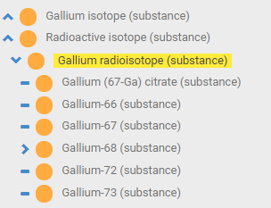
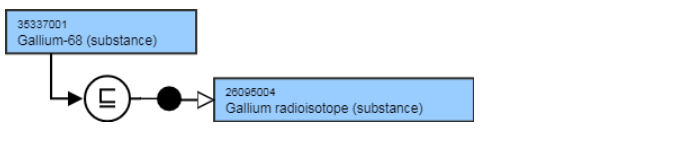
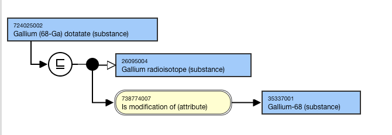
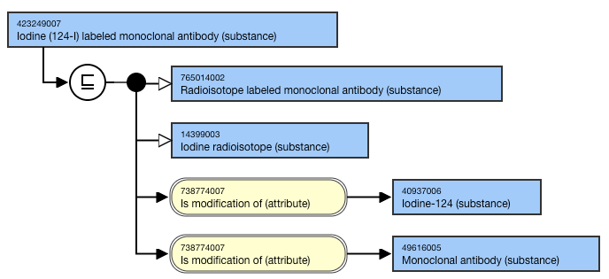

# Radioactive substances

## Representation of radioactive isotopes

## Modeling

Parent concept| Most distal appropriate descendant of 89457008 |Radioactive isotope (substance)|Most distal appropriate descendant of 33638001 |Isotope (substance)|  
---|---  
Semantic tag| (substance)  
Definition status| Primitive  
**Attribute:****Is modification of**| 

  * Range <105590001 |Substance (substance)|
  * Cardinality: 0..*
  * One relationship to be created to represent each modified component of the substance

  
**Attribute:****Has disposition**| 

  * Range: <726711005 |Disposition (disposition)|
    * NOTE: While the allowed range is broader, substance concepts should only use descendants of the concept 726711005 |Disposition (disposition)| as the attribute value.
  * Cardinality: 0..1

  
  
## Naming

Superscripts should not be used in either Fully Specified Name, Preferred Term, or synonyms.

FSN| Pattern:

  * [name of isotope]-[atomic number] (substance)

For example,

  *     *       * Gallium-67 (substance)

  
---|---  
Preferred Term| Pattern:[name of isotope]-[atomic number]For example,

  *     *       * Gallium-67

  
Synonyms| Pattern:

  * [atomic number]-[chemical symbol]

For example,

  *     *       * 67-Ga

  
  
### Exemplar

The following illustrates the hierarchy view:

<figure><figcaption>
The following illustrates the <strong>stated</strong> and <strong>inferred</strong> view:
</figcaption></figure>

  

<figure></figure>

## Representation of radioisotope with salt

## Modeling

Parent concept| Most distal appropriate descendant of 89457008 |Radioactive isotope (substance)|  
---|---  
Semantic tag| (substance)  
Definition status| Primitive  
**Attribute:****Is modification of**| 

  * Range <105590001 |Substance (substance)|
  * Cardinality: 0..*
  * One relationship to be created to represent each modified component of the substance

  
**Attribute:****Has disposition**| 

  * Range: <726711005 |Disposition (disposition) |
  * NOTE: While the allowed range is broader, substance concepts should only use <726711005 |Disposition (disposition)| as the attribute value.
  * Cardinality: 0..1

  
  
## Naming

Superscripts should not be used in either Fully Specified Name, Preferred Term, or synonyms.

Parentheses should be used to delineate the atomic number and chemical symbol from the rest of the terming; this aligns with INN. 

**FSN**|  Pattern: [name of isotope] ([atomic number]-[chemical symbol]) [salt] (substance)For example,

  *     *       * Gallium (67-Ga) citrate (substance)

  
---|---  
**Preferred Term**|  Pattern: [name of isotope] ([atomic number]-[chemical symbol]) [salt]For example,

  *     *       * Gallium (67-Ga) citrate

  
  
### Exemplar - radioisotope with salt

The following illustrates the **stated** and **inferred** view:

<figure></figure>

## Representation of combined radioisotope substances

## Modeling 

Parent concept| Most distal appropriate descendant of 89457008 |Radioactive isotope (substance)| and a second parent identifying the labeled component  
---|---  
Semantic tag| (substance)  
Definition status| Primitive  
**Attribute:****Is modification of**|  Range <105590001 |Substance (substance)|Cardinality: 0..*One relationship to be created to represent each modified component of the substance  
**Attribute:****Has disposition**|  Range: <726711005 |Disposition (disposition) |

  *     * While the allowed range is broader, substance concepts should only use <726711005 |Disposition (disposition)| as the attribute value.

Cardinality: 0..1  
  
## Naming

Superscripts should not be used in either Fully Specified Name, Preferred Term, or synonyms.

The Fully Specified Name should explicitly state that a component was “labeled” by a radioisotope in the FSN. Do not use “with”, “and”, or “tagged”. 

Omit the word “labeled” from the PT; keep a synonym to match the FSN. 

## Exemplar - combined radioisotope substances

The following illustrates both the **stated** and **inferred** view:

<figure></figure>

  

