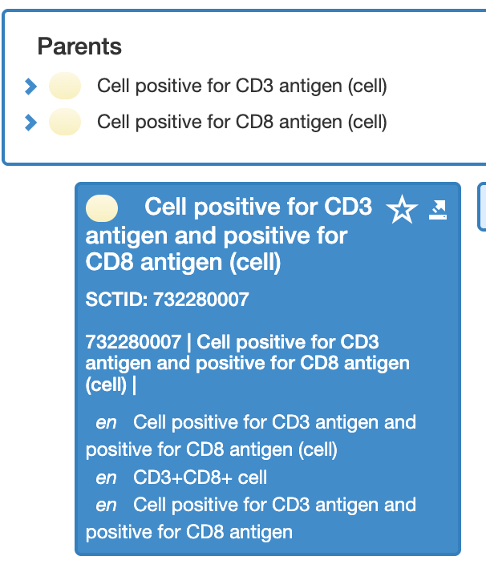

# Cell

## Modeling of cells expressing antigens

As the cell hierarchy is primitive, careful attention is needed to manually identify and add the appropriate supertypes.

Undifferentiated cell concepts with a single positive or negative antigen expression (e.g. cell vs. lymphocyte or blast) are immediate subtypes of 362837007 |Entire cell (cell)|.

* For example,
  * 725316009 |Cell positive for CD1 antigen (cell)| Is a 362837007 |Entire cell (cell)|

Undifferentiated cell concepts with multiple positive or negative antigen expressions should be subtypes of the appropriate cell concepts with those same single and combinations of positive/negative antigen expressions.

Differentiated cells concepts with positive or negative antigen expression(s) should be subtypes of both: a) the differentiated cell concept of differentiation; and b) the appropriate undifferentiated cell concept with the appropriate positive or negative antigen expression(s).

* For example,
  * 117507002 |FMC7+ lymphocyte (cell)| should be a descendant of 56972008 |Lymphocyte (cell)| and also 1373072009 |Cell positive for FMC7 antigen (cell)|.


See also _Naming Convention for Cells Expressing Antigens_

