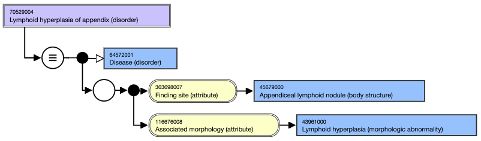
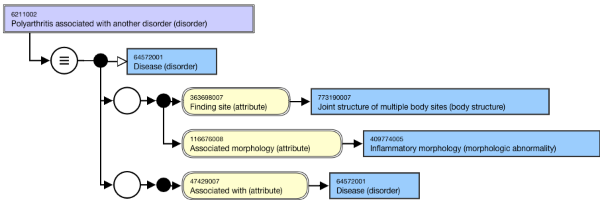
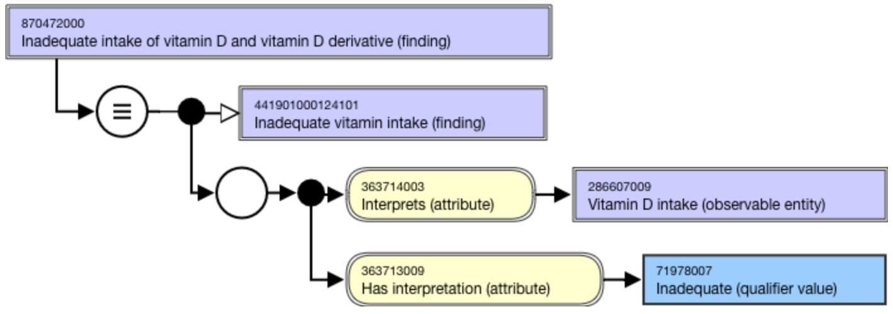
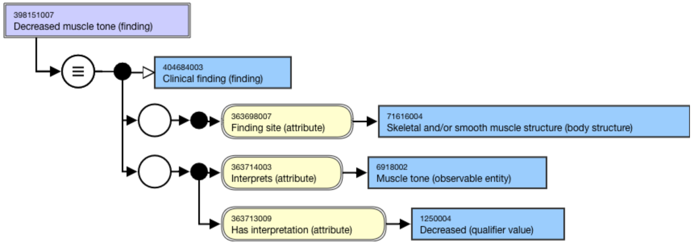

# Clinical Finding Defining Attributes

**Generally, the attributes&#x20;**_**associated with**_**&#x20;,&#x20;**_**before**_**&#x20;,&#x20;**_**during**_**&#x20;,&#x20;**_**after**_**&#x20;,&#x20;**_**due to**_**&#x20;,&#x20;**_**clinical course**_**&#x20;, or&#x20;**_**temporally related to**_**&#x20;are self-grouped, meaning they must not be placed in a relationship group with other attributes; each attribute must be the only attribute in a relationship group. Any rare exceptions will be documented within the individual attribute section below.**

**The Human Readable Concept Model (HRCM)&#x20;**_**grouped**_**&#x20;column (see the** [**Clinical Finding Attributes Summary**](https://confluence.ihtsdotools.org/display/WIPEG/Clinical+Finding+Attributes+Summary) **table on the previous page) correctly indicates that these attributes are put into a relationship group during classification because they are self-grouped.**

The following defining attributes correspond to the _Clinical Finding/Disorder Attributes Summary_ table.

## After

This attribute is used to model concepts in which a clinical finding occurs after another clinical finding, procedure or event. Neither asserting nor excluding a causal relationship, it instead emphasizes a sequence of events. This attribute is self-grouped.

For example,

* ```
  * [ 123948009 | Post-viral disorder (disorder)|](http://snomed.info/id/123948009 "123948009 | Post-viral disorder \(disorder\) |") occurs  [ | After (attribute)|](http://snomed.org/fictid# "\(eg:\)  | After \(attribute\) |") [ 34014006 | Viral disease (disorder)|](http://snomed.info/id/34014006 "34014006 | Viral disease \(disorder\) |")
  ```

A clinical finding may start either: after a variable period of time; immediately following the resolution of its antecedent; or during the course of its antecedent but continue after the antecedent has resolved. These sequences correspond to Allen's interval algebra relations of:

* X takes place before Y
* X meets Y
* X overlaps with Y

## Associated morphology

This attribute specifies the morphologic changes seen at the tissue or cellular level that are characteristic of a disease.

(Please see _Morphologic Abnormalities vs. Findings_ for details).

For example,

* ```
  * [ 75694006 | Pancreatitis (disorder)|](http://snomed.info/id/75694006 "75694006 | Pancreatitis \(disorder\) |") has an Associated morphology (attribute) of  _[ 409774005 | Inflammatory morphology (morphologic abnormality)|](http://snomed.info/id/409774005 "409774005 | Inflammatory morphology \(morphologic abnormality\) |") _
  ```

When selecting a value for this attribute, in general, the concept should not represent a body structure combined with the morphology. There are, however, exceptions, i.e. where a morphology implies the finding site:

For example,

* ```
  * Thymoma (morphologic abnormality)
  ```
  * External hyperostosis (morphologic abnormality)
  * Odontoma (morphologic abnormality)

Body structure should be captured in the value selected for the Finding site attribute. There are, however, exceptions.

For example,

* ```
  * [ 70529004 | Lymphoid hyperplasia of appendix (disorder)|](http://snomed.info/id/70529004 "70529004 | Lymphoid hyperplasia of appendix \(disorder\) |") has [ | Associated morphology (attribute)|](http://snomed.org/fictid# "\(eg:\)  | Associated morphology \(attribute\) |") of __ [ 43961000 | Lymphoid hyperplasia (morphologic abnormality)|](http://snomed.info/id/43961000 "43961000 | Lymphoid hyperplasia \(morphologic abnormality\) |") and a  _[ | Finding site (attribute)|](http://snomed.org/fictid# "\(eg:\)  | Finding site \(attribute\) |") _of [ 45679000 | Appendiceal lymphoid nodule (body structure)|](http://snomed.info/id/45679000 "45679000 | Appendiceal lymphoid nodule \(body structure\) |")
  ```

<figure><figcaption><p>Figure 1. Stated view of Lymphoid hyperplasia of appendix (disorder)</p></figcaption></figure>

## Associated with

[47429007 | Associated with (attribute)|](http://snomed.info/id/47429007) represents a clinically relevant association between concepts without either asserting or excluding a causal or sequential relationship between the two. In general, avoid using the [47429007 | Associated with (attribute)|](http://snomed.info/id/47429007) as it may be ambiguous and difficult to apply consistently.

This attribute is self-grouped.

Areas of content that use this attribute:

* ```
  * Devices
  ```
  * Intolerance to substances
  * Concepts that group specific associations

For example,

[6211002 | Polyarthritis associated with another disorder (disorder)|](http://snomed.info/id/6211002)

<figure><figcaption><p>Figure 2. Stated view of 6211002 |Polyarthritis associated with another disorder (disorder)| using the |Associated with (attribute)|</p></figcaption></figure>

## Before

This attribute is used to model pre-procedure complications (e.g, preoperative complication). It represents temporal associations between procedures and related disorders. This attribute is self-grouped.

## Causative agent

This attribute identifies an organism, substance, physical object, physical force, and/or pharmaceutical/biological product as the direct cause of a condition. It does not include vectors, for example, a mosquito that transmits malaria.

For example,

* ```
  * [ 4989003 | Electrical burn of skin (disorder)|](http://snomed.info/id/4989003 "4989003 | Electrical burn of skin \(disorder\) |") has the  _[ 246075003 | Causative agent (attribute)|](http://snomed.info/id/246075003 "246075003 | Causative agent \(attribute\) |") _of __ [ 18213006 | Electricity (physical force)|](http://snomed.info/id/18213006 "18213006 | Electricity \(physical force\) |")
  ```

Although Pharmaceutical / biologic product (product) and its descendants are considered valid values for Causative agent (attribute) by the MRCM, they are not currently used as values for this attribute in the International Release. The only exception is 787859002 |Vaccine product (medicinal product)| and its descendants, which can be used as valid values for this attribute.

The following guidelines should be considered where the causative agent is a substance:

Concepts representing a clinical finding caused by a base substance (e.g., 836284001 |Pentamethonium (substance)|), a substance structure grouper (e.g. 1149501006 |Substance with ether structure (substance)|), or a substance disposition grouper (e.g. 404642006 |Substance with opioid receptor agonist mechanism of action (substance)|) should be modeled using a causative agent that is a descendant of 105590001 |Substance (substance)|. Classification results are expected to be consistent with the modeling in the Substance hierarchy:

For example,

* 93419003 |Contact dermatitis caused by nickel (disorder)|
* 13503000 |Poisoning caused by naloxone (disorder)|
* 767116002 |Allergy to substance with ether structure (finding)|
* 870376001 |Adverse reaction to dopamine receptor agonist (disorder)|

Concepts representing a clinical finding caused by a substance modification (e.g., 82485006 |Pentamethonium bromide (substance)|) are generally not allowed. Exceptions may be included if the condition caused by the substance modification is significantly different from the one caused by the base substance. Exceptions may include Liposome or lipid complex substances, Pegylated substances, or salt forms:

For example,

* 293908005 |Allergy to chloral hydrate (finding)|
* 296213007 |Fluphenazine decanoate overdose (disorder)|

## Clinical course

This attribute is used to represent both the course and onset of a disease or condition. This attribute is self-grouped.

For example,

* ```
  * [ 74973004 | Chronic fibrosing pancreatitis (disorder)|](http://snomed.info/id/74973004 "74973004 | Chronic fibrosing pancreatitis \(disorder\) |") has a  [ 263502005 | Clinical course (attribute)|](http://snomed.info/id/263502005 "263502005 | Clinical course \(attribute\) |") of [ 90734009 | Chronic (qualifier value)|](http://snomed.info/id/90734009 "90734009 | Chronic \(qualifier value\) |")
  ```

The clinical course value is added when appropriate to the condition and thus specified in the FSN. The distinction is often necessary in those conditions that can have either an acute or a chronic course, such as bronchitis. For those conditions that have only one clinical course, i.e. diabetes is a chronic disease, a wider discussion is necessary before a decision can be made whether to assign a clinical course. Decisions on these concepts are currently made on a case-by-case basis.

Many conditions with acute (sudden) onsets also have acute (short-term) courses. Few conditions with chronic (long-term) durations require rapid versus gradual onset subtyping. Thus, there is no clear need for separating the rapidity of onset from the duration of a disease. The clinical course attribute, which combines onset and course, has been more reproducible and useful than two attributes that attempt to separate the meanings.

The word acute has more than one meaning, and the meanings are often overlapping or unclear. It may imply rapid onset, short duration, or high severity; in some circumstances it might be used to mean all of these. For morphological concepts, acute may also imply the kind of morphology associated with the speed of onset.

For example,

* ```
  * [ 4532008 | Acute inflammation (morphologic abnormality)|](http://snomed.info/id/4532008 "4532008 | Acute inflammation \(morphologic abnormality\) |") does not necessarily have a clinical course of sudden onset and/or short duration, but rather implies polymorphonuclear infiltration ( [ 84499006 | Chronic inflammation (morphologic abnormality)|](http://snomed.info/id/84499006 "84499006 | Chronic inflammation \(morphologic abnormality\) |") implies mononuclear cell infiltration, not necessarily a chronic course, although inflammation with a chronic course is highly correlated with a lymphocytic infiltration)
  ```

2704003 |Acute disease (disorder)| is modeled with a Clinical course (attribute) of Sudden onset AND/OR short duration (qualifier value). For clinical conditions that necessitate further specificity, the more appropriate subtypes are available. \_\__Acute onset_ and s _udden onset_ are synonymous; clinical conditions specifying _acute onset_ should be modeled with a Clinical course (attribute) of Sudden onset (qualifier value).

Acute-on-chronic (qualifier value) is an acute (sudden onset) event superimposed on a pre-existing chronic condition. This be either a sudden worsening of a chronic condition itself (an exacerbation) or the development of a new, separate acute illness on top of a chronic disease.

## Due to

This attribute is used to identify a clinical finding/disorder, event, or procedure concept as the direct cause of another Clinical finding or Disorder concept. If the clinical finding merely predisposes to another disorder, rather than causing it directly, the more general [| Associated with (attribute)|](http://snomed.org/fictid) is used instead.

This attribute is self-grouped.

For example,

* ```
  * [ 43959009 | Cataract of eye due to diabetes mellitus (disorder)|](http://snomed.info/id/43959009 "43959009 | Cataract of eye due to diabetes mellitus \(disorder\) |")
  ```

## During

This attribute is used to model concepts in which a clinical finding occurs during a procedure. Neither asserting nor excluding a causal relationship, it instead emphasizes a sequence of events. This attribute is self-grouped.

For example,

* ```
  * [ 10901000087102 | Hypotension during surgery (disorder)|](http://snomed.info/id/10901000087102 "10901000087102 | Hypotension during surgery \(disorder\) |") has the value Surgical procedure (procedure) for During (attribute)
  ```

## Episodicity

This attribute is used to represent episodes of care provided by a physician or other healthcare provider, not episodes of disease experienced by the patient.

For example,

* ```
  * Asthma with [ 246456000 | Episodicity (attribute)|](http://snomed.info/id/246456000 "246456000 | Episodicity \(attribute\) |") of [ 255217005 | First episode (qualifier value)|](http://snomed.info/id/255217005 "255217005 | First episode \(qualifier value\) |") represents the first time the patient presents to their healthcare provider with asthma.
  ```

Episodicity is not used to model any concepts precoordinated in the International Release, but it can be used as a qualifier in postcoordination.

## Finding informer

This attribute specifies the person or other entity from which the clinical finding information was obtained. It is not about the particular individual but about the category or type of informer. It is used to differentiate patient-reported symptoms from provider-determined signs.

## Finding method

This attribute specifies the means by which a clinical finding was determined. It includes findings that were determined by examination of the patient.

For example,

* ```
  * [ 713071004 | Alcohol misuser in household (finding)|](http://snomed.info/id/713071004 "713071004 | Alcohol misuser in household \(finding\) |") has the  [ 418775008 | Finding method (attribute)|](http://snomed.info/id/418775008 "418775008 | Finding method \(attribute\) |") of [ 84100007 | History taking (procedure)|](http://snomed.info/id/84100007 "84100007 | History taking \(procedure\) |")
  ```

## Finding site

This attribute specifies the body site affected by a condition.

For example,

* ```
  * [ 90708001 | Kidney disease (disorder)|](http://snomed.info/id/90708001 "90708001 | Kidney disease \(disorder\) |") has  [ 363698007 | Finding site (attribute)|](http://snomed.info/id/363698007 "363698007 | Finding site \(attribute\) |") of [ 64033007 | Kidney structure (body structure)|](http://snomed.info/id/64033007 "64033007 | Kidney structure \(body structure\) |")
  ```

## Has interpretation

This attribute refers to and designates the judgment aspect being evaluated or interpreted (e.g. presence, absence, degree, normality, abnormality, etc.). Subtypes of Environment or geographical location (environment / location) can also be used as the value in cases such as specifying a location of an incident to be reported to death and injury registries.

Interprets and Has Interpretation are grouped together in a relationship group without any other attributes.

For example,

<figure><figcaption><p>Figure 3. Inferred view of Inadequate intake of vitamin D and vitamin D derivative (finding)</p></figcaption></figure>

Qualifier values of |Below reference range| and |Above reference range| are preferred over values such as high/low, increased/decreased, etc. to describe Measurement finding (finding) concepts.

## Interprets

This attribute refers to the entity being evaluated or interpreted, when an evaluation, interpretation, or judgment is intrinsic to the meaning of a concept.

Interprets and Has Interpretation are grouped together in a relationship group without any other attributes. Interprets may be used in a relationship group by itself without any other attributes if the value of the observable is not defined.

For example,

<figure><figcaption><p>Figure 4. Stated view of |Decreased muscle tone (finding)|</p></figcaption></figure>

In general, the value for the |Interprets| attribute should be from the |Observable entity| hierarchy rather than the |Procedure| hierarchy.

|Observable entity| concepts that are modeled with a |Scale type (attribute)| relationship should not be used as a value for a Clinical finding's |Interprets| relationship. The existing _vital sign_ |Observable entity| concepts, e.g. |Arterial blood pressure (observable entity)| are exceptions to this guideline; they are permitted for use.

In the guidance on the use of the [|Scale type (attribute)](../../../../authoring/observable-entity/observable-entity-defining-attributes.md)|, it has been noted that going forward, international |Observable entity| concepts will not be modeled with the [|](http://snomed.org/fictid)Scale type (attribute)[|](http://snomed.org/fictid). Extension concepts are permitted to add specific subtypes of observable entities that include the [|](http://snomed.org/fictid)Scale type (attribute)[|](http://snomed.org/fictid), if desired.

Be aware that SNOMED CT currently contains some concepts in the |Evaluation Procedure| hierarchy which logically belong in the |Observable entity| hierarchy. Reconciliation of the overlap between these two hierarchies will be undertaken at a future date. Discussions about the final solution for the |Observable entity| and |Evaluation Procedure| issue are ongoing. See [Observable Entity vs. Evaluation procedure](../../../../authoring/observable-entity/observable-entity.md).

When working with the Interprets attribute, consider the values used by the supertypes and possible subtypes of your concept for this attribute. This is because the |Interprets| values must be drawn from the same hierarchy, e.g. |Observable entity| hierarchy or |Procedure| hierarchy as supertypes and subtypes, to support modeling and correct subsumption.

For concepts in the 118245000 |Measurement finding (finding)| subhierarchy, the value for 363714003 |Interprets (attribute)| can be an Evaluation procedure, Laboratory procedure, or an Observable entity concept. In the future, the range of values may change when discussion of the relationship between evaluation procedures and observable entities concludes.

## Has realization

This attribute is used to specify the process or activity that is the consequence of realization of the function.

Allergy to X is modeled with [719722006 | Has realization (attribute)|](http://snomed.info/id/719722006) of [472964009 | Allergic process (qualifier value)|](http://snomed.info/id/472964009) and [246075003 | Causative agent (attribute)|](http://snomed.info/id/246075003) of [105590001 | Substance (substance)|](http://snomed.info/id/105590001) . Find the allergy template at the [Clinical finding/disorder templates](https://prod-confluence.ihtsdotools.org/pages/viewpage.action?pageId=64260419) page for more information including exceptions.

## Occurrence

This attribute refers to the specific period of life during which a condition first presents. However, conditions may persist beyond the period of life when they first present.

For example,

* ```
  * [ 192611004 | Childhood phobic anxiety disorder (disorder)|](http://snomed.info/id/192611004 "192611004 | Childhood phobic anxiety disorder \(disorder\) |") has the  [ 246454002 | Occurrence (attribute)|](http://snomed.info/id/246454002 "246454002 | Occurrence \(attribute\) |") of  [ 255398004 | Childhood (qualifier value)|](http://snomed.info/id/255398004 "255398004 | Childhood \(qualifier value\) |")
  ```

Multiple values of [246454002 | Occurrence (attribute)|](http://snomed.info/id/246454002) for a single concept are not desirable. They will be addressed in a future release.

## Pathological process

This attribute provides information about the underlying pathological process of a disorder, i.e. it describes the process that results in the structural or morphologic change.

[441862004 | Infectious process (qualifier value)|](http://snomed.info/id/441862004) and its subtype [442614005 | Parasitic process (qualifier value)|](http://snomed.info/id/442614005) are included in the range for [370135005 | Pathological process (attribute)|](http://snomed.info/id/370135005) . These are used in modeling the [40733004 | Infectious disease (disorder)|](http://snomed.info/id/40733004) subhierarchy.

For example,

* ```
  * [ 17322007 | Disease caused by parasite (disorder)|](http://snomed.info/id/17322007 "17322007 | Disease caused by parasite \(disorder\) |") has the  [ 370135005 | Pathological process (attribute)|](http://snomed.info/id/370135005 "370135005 | Pathological process \(attribute\) |") of [ 442614005 | Parasitic process (qualifier value)|](http://snomed.info/id/442614005 "442614005 | Parasitic process \(qualifier value\) |")
  ```

[370135005 | Pathological process (attribute)|](http://snomed.info/id/370135005) must not be used for values that could overlap with [116676008 | Associated morphology (attribute)|](http://snomed.info/id/116676008) .

For example,

* ```
  * Inflammatory processes result in inflammation (by definition), but these disorders should be defined by their morphology, i.e.  [ 708039003 | Inflammatory lesion (morphologic abnormality)|](http://snomed.info/id/708039003 "708039003 | Inflammatory lesion \(morphologic abnormality\) |")
  ```

Disorders which involve congenital anomalies are defined with the following grouped attribute-value pairs:

* Occurrence (attribute) = congenital (qualifier value)
* Associated morphology (attribute) = << 49755003 |Morphologically abnormal structure (morphologic abnormality)|
* Pathological process (attribute) = pathological development process (qualifier value)
* Finding site = X (body structure)

Congenital X morphology concepts should not be used. They may be used only if there is not a non-congenital supertype.

## Severity

This attribute is used to subclass a Clinical finding concept according to its severity. However, this use is _relative_ , i.e. it is incorrect to assume that the disease intensity or hazard is the same for all clinical findings to which this attribute is applied.

The 246112005 |Severity (attribute)| may be applied to subtypes of Clinical finding (excluding << Symptom severity (finding)) to represent the severity of a finding or disease.

While this attribute is useful to create subtypes of specific concepts and to differentiate the severity of a single disorder, it is not commonly used, and care must be taken when applying it. This is because:

* Severity may be interpreted in different ways, depending on the set of values available. Consider the different meaning of severity in each of the following value sets:
  * mild / moderate / severe
  * minimal / mild / moderate / severe / very severe
  * mild / mild to moderate / moderate / moderate to severe / severe / life threatening / fatal
* Severity is defined relative to the expected degree of intensity or hazard of the Clinical finding that is being qualified. For example, the common cold has a baseline intensity or hazard that is much less than a more serious disease like lupus erythematosus or pneumonia; thus, a severe cold might be considered less intense or less hazardous than mild pneumonia.
* Some disorders that are life-threatening do not ordinarily have a severity assigned to them. Cancer, for example, is not usually described as mild, moderate, or severe, but rather by stage or grade.

The Severity attribute is not applied to subtypes of 162465004 |Symptom severity (finding)| because the severity of a symptom is different to the severity of a disease. Please note this piece of guidance does not align with the MRCM but is an editorial guideline.

Generally, |Severity (attribute)| is not used to model concepts precoordinated in the International Release, but there are some exceptions.

Non-standardized or locally defined severity values will not be recognized or supported in SNOMED CT. However, severity values explicitly defined and standardized by an internationally recognized standard are acceptable. A valid exception requires an internationally accepted definition that can be consistently applied and used reliably for international comparison. Even though a reference may be internationally sourced, its use may not always be uniformly applied by multiple countries. Classifications of severity that represent variation in clinical presentations and enact limitations with age ranges, sex, or pregnancy status, do not apply universally to all patients of all ages, prove problematic, and may not be generally useful.

As an alternative to pre-coordination in the international release, this severity attribute can be used as a qualifier in postcoordination. However, beware that postcoordination of severity results in the same irreproducibility issues as pre-coordination.

## Temporally related to

726633004 |Temporally related to (attribute)| applies to perioperative complications and clinical findings where there is no causal relationship but a time-relative association exists.

This attribute's subhierarchy specifies the associated time period (i.e. before, during, after) between two clinical findings, e.g., |Pediatric inflammatory multisystem syndrome temporally associated with COVID-19|; or between a clinical finding and a procedure, e.g., perioperative complications temporally related to a surgical procedure (i.e. preoperative, intraoperative, and postoperative).

This attribute is self-grouped.
