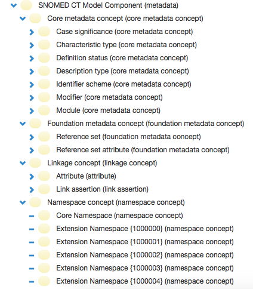
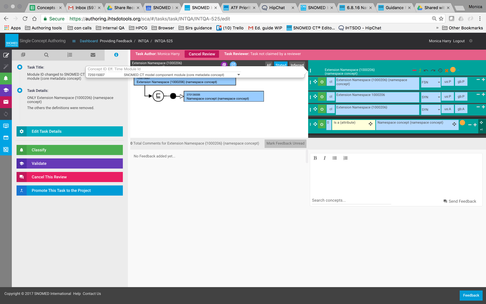

# SNOMED CT Model Component

| Definition                                                                                            | Types                                                                                                                                                                                                                                                                                      |
| ----------------------------------------------------------------------------------------------------- | ------------------------------------------------------------------------------------------------------------------------------------------------------------------------------------------------------------------------------------------------------------------------------------------ |
| Concepts and attributes necessary to organize and structure SNOMED CT terminology and its derivatives | <ul><li>900000000000442005|Core metadata concept (core metadata concept)| </li><li>900000000000454005|Foundation metadata concept (foundation metadata concept)| </li><li>106237007|Linkage concept (linkage concept)| </li><li>370136006|Namespace concept (namespace concept)|</li></ul> |

## SNOMED Model component module (metadata)

<figure><figcaption></figcaption></figure>

## Core metadata concept

Subtypes of [900000000000442005 | Core metadata concept (core metadata concept)|](http://snomed.info/id/900000000000442005) provide structural information required to support International Release data. This supporting information includes sets of enumerated values that apply to attributes of concepts, descriptions, and relationships.

## Foundation metadata concept

Subtypes of the [900000000000454005 | Foundation metadata concept (foundation metadata concept)|](http://snomed.info/id/900000000000454005) provide supporting metadata and structural information for derivative release structures including Reference Sets.

## Linkage concept

A [106237007 | Linkage concept (linkage concept)|](http://snomed.info/id/106237007) links two or more concepts to express compositional meanings. All concept codes that can be used as a _Relationship Type_ are included under Linkage concept (linkage concept). The Concept Model attributes are approved for use.

Linkage concept is a subtype of 900000000000441003 |SNOMED CT Model Component (metadata)|. The Linkage concept hierarchy \_\_ has the subhierarchies:

* Attribute (attribute)
* Link assertion (link assertion)

Concepts in the Linkage concept subhierarchy are used to construct relationships between two SNOMED CT concepts; they indicate the relationship type between those concepts. Some attributes (relationship types) can be used to logically define a concept (defining attributes).

### Unapproved attributes

408739003 |Unapproved attribute (attribute)| is a subtype within this hierarchy with over a thousand descendants. Unapproved attributes in the SNOMED CT Concept model may be used to create post-coordinated expressions with caution. Use of unapproved attributes is neither supported by the MRCM nor recommended beyond intraorganizational use. Approved attributes are those that fit the MRCM for data sharing and interoperability between systems. Unapproved attributes are used for creating expressions within a single system for semantic matching of vendor terms (i.e. those that are used for mapping of interface terms, clinical decision support that use components within the expression, etc.).

Users should beware that unapproved attributes can potentially

* conflict with approved attributes if used without discretion
* change into an approved attribute if warranted by SNOMED International

## Namespace concept

[370136006 | Namespace concept (namespace concept)|](http://snomed.info/id/370136006) is a subtype of 900000000000441003 |SNOMED CT Model Component (metadata)|. Each of its subtypes has an integer term which is an assigned extension namespace identifier.

New namespace concepts are requested via email to _info@snomed.org_. A SNOMED International staff terminologist will add new extension namespace identifiers as requests are received. It is also necessary to change the Module ID per the following:

<figure><figcaption>
For further details, see <em>Namespace identifiers</em> on the SNOMED website at: . Find the <em>Namespace Identifier Registry</em> at
</figcaption></figure>
