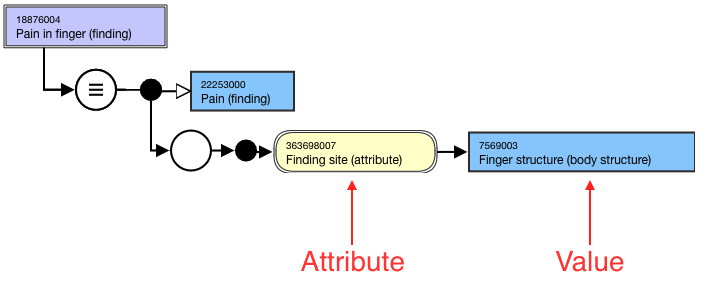
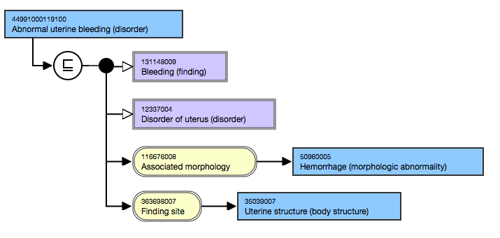
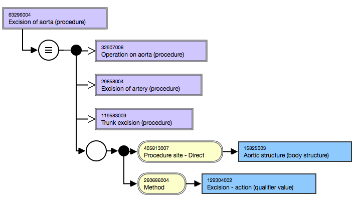
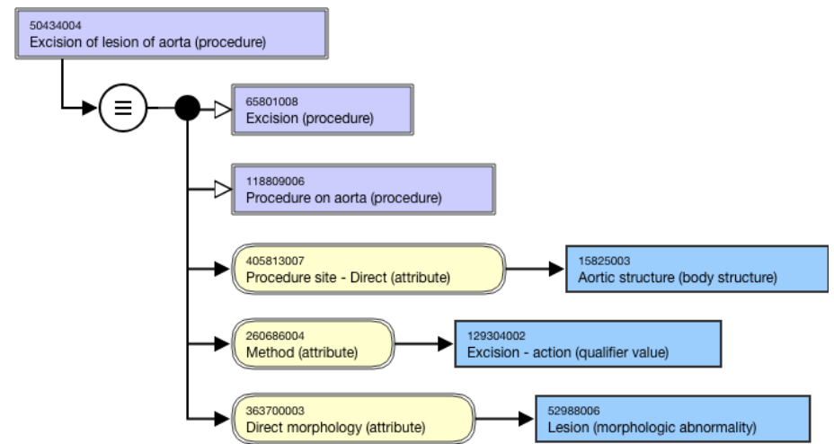
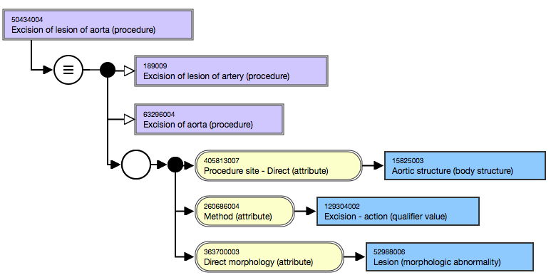
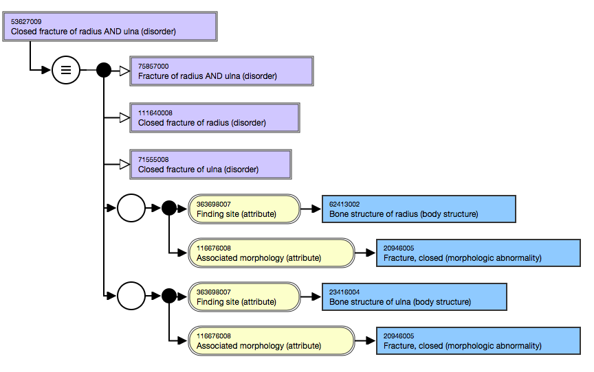
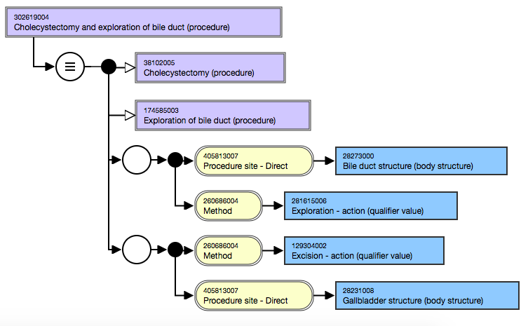
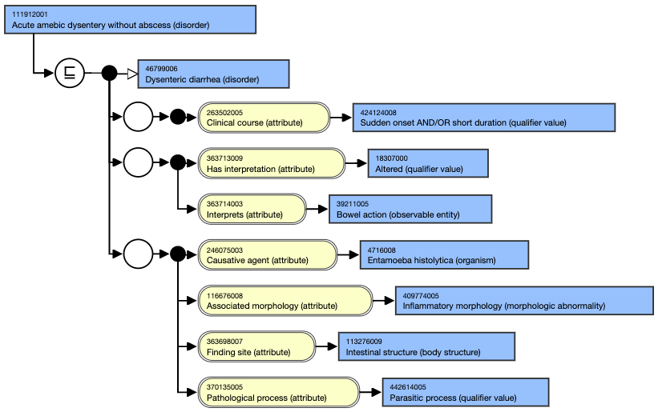
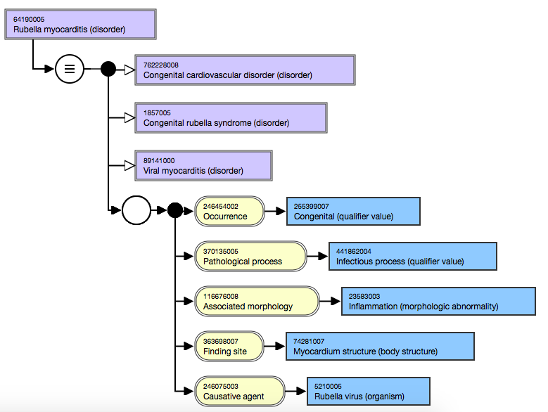
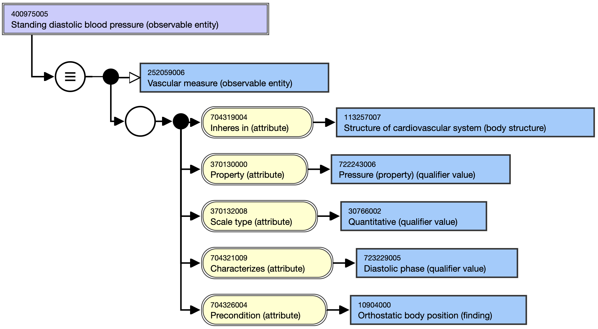

# Relationship Group

This page describes the grouping of attributes.

A _relationship_ _group_ combines an [attribute-value pair](https://confluence.ihtsdotools.org/display/DOCGLOSS/attribute+value+pair) with none, one, or multiple attribute-value pairs in order to refine the meaning of a concept.

For example,

<figure><figcaption>
Stated view of 18876004 |Pain in finger (finding)| with the Finding site (attribute) and its value of Finger structure (body structure)
</figcaption></figure>

An attribute must be populated with a target value to model a concept.

Relationship groups are needed when modeling:

* Clinical finding concepts that require multiple Associated morphology attributes and multiple Finding site attributes
* Procedure concepts that require multiple Method attributes and multiple Procedure site attributes.
* A single relationship group containing only one attribute can exist.
  * When an attribute is restricted to a single group with no other attributes, the attribute is described as being "self-grouped".
* Multiple attributes may be grouped together in relationship groups, and multiple relationship groups may be created to sufficiently define concepts.
* When creating new concepts or revising existing ones, each attribute type included in a relationship group may only be present once, e.g. two Associated morphology attributes cannot be in the same relationship group.
* Relationship groups are not limited to Clinical finding and Procedure concepts.
* There is no limit to the number of relationship groups that may be added to a concept.


As with all authoring activities, grouping of attributes is performed in the stated view.


## Ungrouped attributes

An attribute that is not in a relationship group is considered to be in a group on its own. When attributes are not grouped, their meanings are interpreted separately. For example, in the following diagram, the _Associated morphology_ is Hemorrhage, and the _Finding site_ is Uterine structure. However, it cannot be interpreted that the site of the Hemorrhage is the Uterine structure because the two attributes are not grouped.

<figure><figcaption>
Inferred view of self-grouped attributes values of Hemorrhage (morphologic abnormality) and Uterine structure (body structure)
</figcaption></figure>

When the attributes are grouped, the relationships imply meaning towards each other. To continue the example above for [44991000119100 | Abnormal uterine bleeding (disorder)|](http://snomed.info/id/44991000119100) , the following diagram shows the _Associated morphology_ of Hemorrhage and the _Finding site_ of Uterine structure in a relationship group together. The grouping can be interpreted that the finding site of the hemorrhage is the uterine structure.

<figure><figcaption>
Inferred view of grouped attribute values of Hemorrhage (morphologic abnormality) and Uterine structure (body structure)
</figcaption></figure>

Note the difference in the inferred parents between the self-grouped versus grouped attributes. This is explained in more detail below.

## Impact of relationship grouping on inheritance

Relationship groups refine inheritance, i.e., a grouped set of attributes is more specific than the same attributes that are not grouped. This is important when considering subsumption. The following diagrams demonstrate the impact of grouping or failing to group consistently using the concepts [50434004 | Excision of lesion of aorta (procedure)|](http://snomed.info/id/50434004) and one of its supertypes, [63296004 | Excision of aorta (procedure)|](http://snomed.info/id/63296004) .

The meaning of the supertype concept, [63296004 | Excision of aorta (procedure)|](http://snomed.info/id/63296004) (where the relationships are grouped) is interpreted as a procedure with an excision on the aortic structure. This is because [405813007 | Procedure site - Direct (attribute)|](http://snomed.info/id/405813007) and [260686004 | Method (attribute)|](http://snomed.info/id/260686004) are grouped.

<figure><figcaption>
Inferred view of Excision of aorta (procedure) with grouping of attributes
</figcaption></figure>

In the following diagram, the more general supertype concepts, [65801008 | Excision (procedure)|](http://snomed.info/id/65801008) and [118809006 | Procedure on aorta (procedure)|](http://snomed.info/id/118809006) are the proximal supertype concepts.

[50434004 | Excision of lesion of aorta (procedure)|](http://snomed.info/id/50434004) is a logical subtype of [63296004 | Excision of aorta (procedure)|](http://snomed.info/id/63296004) . However, the attributes of the concept [50434004 | Excision of lesion of aorta (procedure)|](http://snomed.info/id/50434004) are not grouped. Thus, the classifier interprets the definitions as non-related and [50434004 | Excision of lesion of aorta (procedure)|](http://snomed.info/id/50434004) is not inferred as a subtype of [63296004 | Excision of aorta (procedure)|](http://snomed.info/id/63296004) . This is because the attributes in the subtype concept are not grouped, i.e are not explicitly stated. From a machine-processing perspective, each attribute is considered a group on its own; i.e., there is an excision, but nothing else is known about the excision. This results in the concept, [63296004 | Excision of aorta (procedure)|](http://snomed.info/id/63296004) , being interpreted more broadly.

<figure><figcaption>
Inferred view of Excision of lesion of aorta (procedure) without grouping of attributes
</figcaption></figure>

In the following diagram the attributes of the concept [50434004 | Excision of lesion of aorta (procedure)|](http://snomed.info/id/50434004) are grouped. An author that explicitly states that the excision is of a lesion found in the aortic structure, by grouping the attribute-value pairs, provides the necessary information for the classifier. This enables [50434004 | Excision of lesion of aorta (procedure)|](http://snomed.info/id/50434004) to be inferred as a subtype of [63296004 | Excision of aorta (procedure)|](http://snomed.info/id/63296004) .

<figure><figcaption>
Inferred view of Excision of lesion of aorta (procedure) with grouping of attributes
</figcaption></figure>

## Same attributes in separate relationship groups

Each relationship group should only contain one instance of an attribute. This is because two of the same attributes in a relationship group is not the same as one attribute with one target value that captures the combined meaning of the target values, as illustrated in the following diagram.

Two Finding site attributes are required to support the location of [53627009 | Closed fracture of radius AND ulna (disorder)|](http://snomed.info/id/53627009) . Each [363698007 | Finding site (attribute)|](http://snomed.info/id/363698007) and its respective target value are placed in a relationship group with the attribute [116676008 | Associated morphology (attribute)|](http://snomed.info/id/116676008) with its target value of [20946005 | Fracture, closed (morphologic abnormality)|](http://snomed.info/id/20946005) .

<figure><figcaption>
Inferred view of Associated morphology (attribute) with its value of Fracture, closed (morphologic abnormality) in two separate relationship groups
</figcaption></figure>

## Procedure hierarchy

In the [71388002 | Procedure (procedure)|](http://snomed.info/id/71388002) hierarchy, a relationship group is usually a way of combining attributes about a particular method.

In the concept [302619004 | Cholecystectomy and exploration of bile duct (procedure)|](http://snomed.info/id/302619004) within the following diagram, the relationship groups clarify that there is exploration of the bile duct and excision of the gallbladder. Without the relationship groups, the appropriate relationships between the attributes would be unclear; i.e. the exploration of the bile duct versus gallbladder and the excision of the bile duct versus the gallbladder.

<figure><figcaption>
Inferred view of a Procedure hierarchy relationship group: combining attributes around Method (attribute)
</figcaption></figure>

When there is no _Method_ stated, the [363704007 | Procedure site (attribute)|](http://snomed.info/id/363704007) (or its subtype either _Procedure site-direct_ or _Procedure site-indirect_) is always grouped with [405816004 | Procedure morphology (attribute)|](http://snomed.info/id/405816004) (or its subtype either _Direct morphology_ or _Indirect morphology_) for that site.


Self-grouped Procedure attributes

* [260870009 | Priority (attribute)|](http://snomed.info/id/260870009) is to be grouped on its own, or "self-grouped", as the priority of a procedure applies to the entire procedure and not the specific elements of the procedure.
* 363702006 |Has focus (attribute)| is also self-grouped.


## Clinical Finding/Disorder hierarchy

In the Clinical finding/Disorder hierarchy:

* The Finding site (attribute) and Associated morphology (attribute) are always grouped when both are present and related.
  * When there is more than one Finding site (attribute) or Associated morphology (attribute), then more than one relationship group is required.
  * When the attributes _Occurrence_ and/or _Causative agent_ are stated and related to the _Finding site_ and _Associated morphology_ attributes, include them within that relationship group.
    * As in the following diagram, when the Causative agent (attribute) is an organism, the Pathological process (attribute) is also included in that relationship group, with the target value of either [441862004 | Infectious process (qualifier value)|](http://snomed.info/id/441862004) or [442614005 | Parasitic process (qualifier value)|](http://snomed.info/id/442614005) .
* If a concept has values for a Causative agent (attribute) and Finding site (attribute), but does not have a value for an Associated morphology (attribute) or Pathological process (attribute), combine the Causative agent (attribute) and Finding site (attribute) as usual. Concepts that only have Causative agent (attribute) and Finding site (attribute) in a role group are higher in the hierarchy and subsume those concepts that have a role group of Causative agent (attribute), Finding site (attribute), Associated morphology (attribute) and Pathological process (attribute).
* The _Interprets_ and _Has interpretation_ attributes are always grouped together where both are present and related to each other. These two attributes and their values are often used in defining a Clinical finding concept by delineating the observation results or describing the analysis used to determine the observation. _Interprets_ and _Has interpretation_ attributes are not grouped with any other attributes.


A relationship group that uses the attributes _**Associated with, Before, During , After, Due to, Clinical course, or Temporally related to**_ are not grouped with another attribute-value pair; these attributes are "self-grouped".  This means, authors place these attributes in a relationship group individually with no other attributes.


<figure><figcaption>
Stated view of a disorder hierarchy concept with Causative agent and Pathological process attributes in the same relationship group
</figcaption></figure>

<figure><figcaption></figcaption></figure>

## Situation with Explicit Context hierarchy

For [413350009 | Finding with explicit context (situation)|](http://snomed.info/id/413350009) concepts, the following four attributes are grouped:

* [408729009 | Finding context (attribute)|](http://snomed.info/id/408729009)
* [246090004 | Associated finding (attribute)|](http://snomed.info/id/246090004)
* [408731000 | Temporal context (attribute)|](http://snomed.info/id/408731000)
* [408732007 | Subject relationship context (attribute)|](http://snomed.info/id/408732007)

_For example,_&#x20;

[704008007 | No family history of asthma (situation)|](http://snomed.info/id/704008007) _IS A_ [243796009 | Situation with explicit context (situation)|](http://snomed.info/id/243796009),

* [408729009 | Finding context (attribute)|](http://snomed.info/id/408729009), [410516002 | Known absent (qualifier value)|](http://snomed.info/id/410516002)
* [246090004 | Associated finding (attribute)|](http://snomed.info/id/246090004), [195967001 | Asthma (disorder)|](http://snomed.info/id/195967001)
* [408731000 | Temporal context (attribute)|](http://snomed.info/id/408731000), [410511007 | Current or past (actual) (qualifier value)|](http://snomed.info/id/410511007)
* [408732007 | Subject relationship context (attribute)|](http://snomed.info/id/408732007), [444148008 | Person in family of subject (person)|](http://snomed.info/id/444148008)

For [129125009 | Procedure with explicit context (situation)|](http://snomed.info/id/129125009) concepts the following four attributes are grouped:

* [408730004 | Procedure context (attribute)|](http://snomed.info/id/408730004)
* [363589002 | Associated procedure (attribute)|](http://snomed.info/id/363589002)
* [408731000 | Temporal context (attribute)|](http://snomed.info/id/408731000)
* [408732007 | Subject relationship context (attribute)|](http://snomed.info/id/408732007)

_For example,_

[704503005 | Advice given about pelvic floor exercise (situation)|](http://snomed.info/id/704503005) _IS A_ [129125009 | Procedure with explicit context (situation)|](http://snomed.info/id/129125009)

* [408730004 | Procedure context (attribute)|](http://snomed.info/id/408730004), [385658003 | Done (qualifier value)|](http://snomed.info/id/385658003)
* [363589002 | Associated procedure (attribute)|](http://snomed.info/id/363589002), [420227002 | Recommendation to (procedure)|](http://snomed.info/id/420227002)
* [408731000 | Temporal context (attribute)|](http://snomed.info/id/408731000), [410512000 | Current or specified time (qualifier value)|](http://snomed.info/id/410512000)
* [408732007 | Subject relationship context (attribute)|](http://snomed.info/id/408732007), [125676002 | Person (person)|](http://snomed.info/id/125676002)

## Observable Entity hierarchy

When defining [363787002 | Observable entity (observable entity)|](http://snomed.info/id/363787002) concepts, attributes are grouped.

For example, [400975005 | Standing diastolic blood pressure (observable entity)|](http://snomed.info/id/400975005) is represented using multiple attributes within one relationship group.

<figure><figcaption>
Stated view of a concept from the Observable entity hierarchy with grouped attributes
</figcaption></figure>
