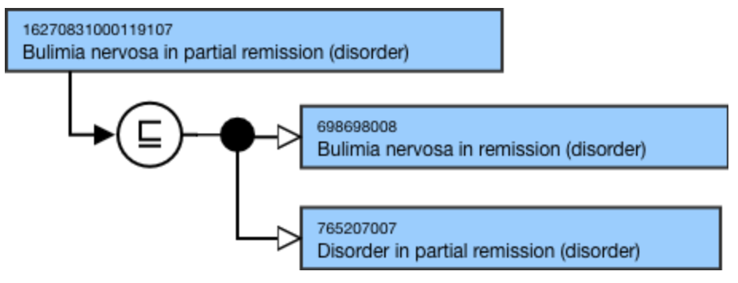
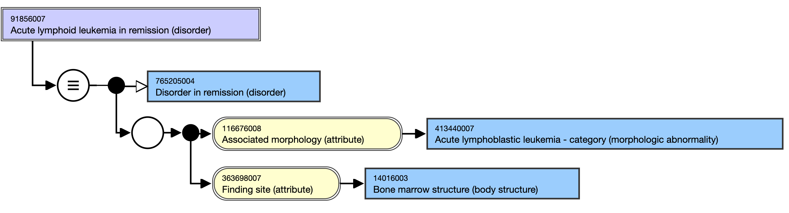

# Remission

## Disorder in remission

 _< X> disorder in remission_ concepts require a stated relationship to the appropriate primitive  _Disorder in remission_ supertype, in addition to the appropriate supertype for the disorder. 

For example, 

[16270831000119107 |Bulimia nervosa in partial remission (disorder)|](http://snomed.info/id/16270831000119107) has stated parents of 698698008 |Bulimia nervosa in remission (disorder)| and [765207007 |Disorder in partial remission (disorder)|](http://snomed.info/id/765207007).

<figure><figcaption>
Figure 1: Stated view of 16270831000119107 |Bulimia nervosa in partial remission (disorder)|
</figcaption></figure>

  

Where the primitive supertype for the disorder is |Disease (disorder)|, only the  _Disorder in remission_ supertype will be required.

For example,

[91856007 |Acute lymphoid leukemia in remission (disorder)|](http://snomed.info/id/91856007) has only one stated parent of[ 765205004 |Disorder in remission (disorder)|](http://snomed.info/id/765205004), because a potential supertype of [ 64572001 |Disease (disorder)|](http://snomed.info/id/64572001) would be unnecessary. 

<figure><figcaption>
Figure 2: Stated view of 91856007 |Acute lymphoid leukemia in remission (disorder)|
</figcaption></figure>

  

  

See also relative section(s):

Mental health
