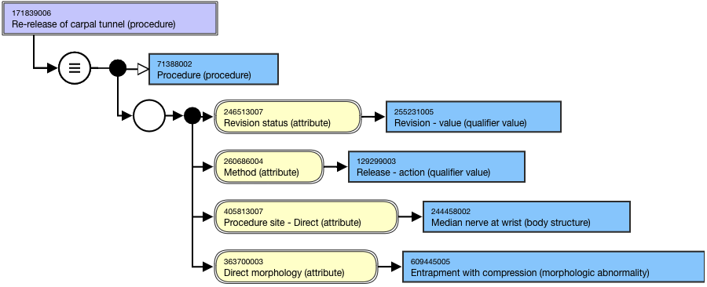

# Revision

A  _revision procedure_ may or may not be a subtype of the original procedure. Revision procedure concepts should be in the[ 118635009 |Revision (procedure)|](http://snomed.info/id/118635009) sub-hierarchy. 

For example,

[171839006 |Re-release of carpal tunnel (procedure)|](http://snomed.info/id/171839006) is modeled as follows:

<figure><figcaption>
Figure 1: Stated view of 171839006 |Re-release of carpal tunnel (procedure)|
</figcaption></figure>

