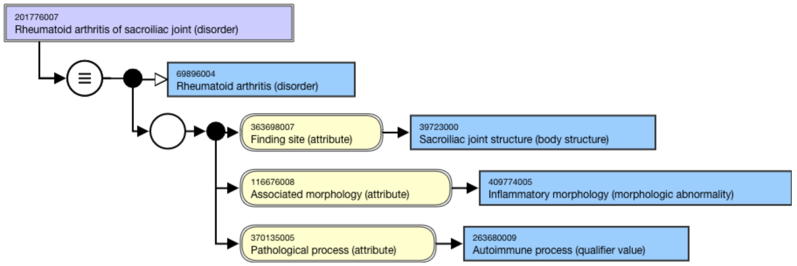
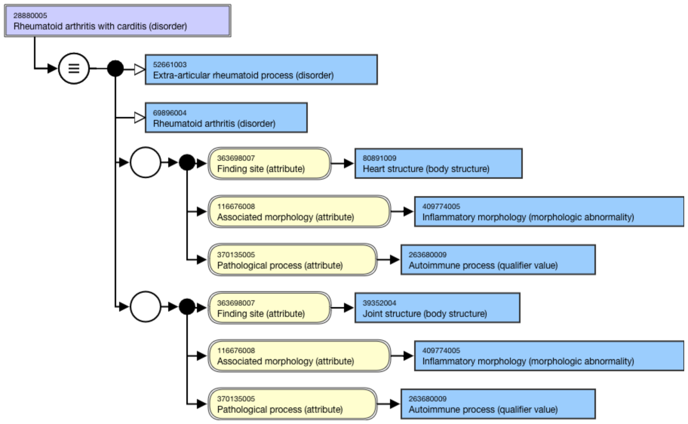

# Rheumatoid arthritis

Rheumatoid arthritis (RA) is a multisystem, inflammatory, autoimmune disorder; the exact etiology is unknown. RA is a disease primarily of the joints and is clinically known as an 'arthritis' although extra-articular manifestations occur. Extra-articular features include nodules, carditis and pericarditis, vasculitis, lung disorders, and other manifestations.

69896004 |Rheumatoid arthritis (disorder)| remains a primitive concept in SNOMED CT and must be stated as a parent (IS A relationship) for all rheumatoid arthritis concepts.

For example, 

201776007 |Rheumatoid arthritis of sacroiliac joint (disorder)|

<figure><figcaption>
Figure 1: Stated view of 201776007 |Rheumatoid arthritis of sacroiliac joint (disorder)|
</figcaption></figure>

  

Example of extra-articular rheumatoid manifestation,

28880005 |Rheumatoid arthritis with carditis (disorder)|

<figure><figcaption>
Figure 1: Stated view of 28880005 |Rheumatoid arthritis with carditis (disorder)|
</figcaption></figure>

  

  

  

  

