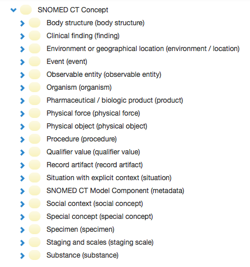

# Root and Top-level Concepts

## Concept

A _concept_ is defined as a clinical idea to which a unique [concept identifier](https://confluence.ihtsdotools.org/display/DOCGLOSS/concept+identifier "Glossary link: concept identifier") has been assigned. Concepts are associated with [descriptions](https://confluence.ihtsdotools.org/display/DOCGLOSS/description "Glossary link: descriptions") that contain human-readable terms describing the concept.

A  _term_ is defined as a human-readable phrase that names or describes a [concept](https://confluence.ihtsdotools.org/display/DOCGLOSS/concept "Glossary link: concept"). A term is one of the properties of a [description](https://confluence.ihtsdotools.org/display/DOCGLOSS/description "Glossary link: description"). Other properties of a [description](https://confluence.ihtsdotools.org/display/DOCGLOSS/description "Glossary link: description") link the term to an identified [concept](https://confluence.ihtsdotools.org/display/DOCGLOSS/concept "Glossary link: concept") and indicate the type of description, e.g. Fully Specified Name, Preferred Term, Synonym.

Concepts are linked to their more general parent concepts directly above them in a hierarchy. More general meanings, are usually at the top of the hierarchy. Descending levels of the hierarchy contain more specific or specialized meanings.

Concepts are logically defined by their relationships to each other.

In SNOMED CT, the default meaning of a concept is defined above. However, a concept may have other meanings in SNOMED CT, such as an: 

  * Abbreviated name for the [concept identifier](https://confluence.ihtsdotools.org/display/DOCGLOSS/concept+identifier "Glossary link: concept identifier"). For clarity, this is should be referred to as an _identifier_(_ID_),  _code,_ or  _concept identifier_ (_ID_).
  * Idea or class of real-world entities (common usage meaning). For clarity, this is should be referred to as a _clinical idea_ , _clinical meaning,_ or _code meaning_. 

## Root Concept

The concept file includes a special concept referred to as the _root concep_ t. It is the single concept that is at the top of the SNOMED CT concept hierarchy. All other concepts are descended from this root concept via at least one series of relationships of the Relationship type [ 116680003 | Is a (attribute)|](http://snomed.info/id/116680003 "116680003 | Is a \(attribute\) |") , i.e. all other concepts are regarded as subclasses of this concept. The root concept code is [ 138875005 | SNOMED CT Concept (SNOMED RT+CTV3)|](http://snomed.info/id/138875005 "138875005 | SNOMED CT Concept \(SNOMED RT+CTV3\) |") . All other SNOMED CT concepts are subtypes of the root concept. Unlike other SNOMED CT concepts, the root concept is not a subtype of any other concept.

<figure></figure>

## Top-level Concepts

Concepts that are directly related to the root concept by a single relationship of the Relationship type [ 116680003 | Is a (attribute)|](http://snomed.info/id/116680003 "116680003 | Is a \(attribute\) |") are referred to as _top-level concepts_. All other concepts are descended from at least one top-level concept via at least one series of relationships of the Relationship type [ 116680003 | Is a (attribute)|](http://snomed.info/id/116680003 "116680003 | Is a \(attribute\) |") , i.e. all other concepts represent subclasses of the meaning of at least one top-level concept.

### Top-level metadata concepts

A concept that is directly related to the root metadata concept, [ 900000000000441003 | SNOMED CT Model Component (metadata)|](http://snomed.info/id/900000000000441003 "900000000000441003 | SNOMED CT Model Component \(metadata\) |") by a single relationship of the relationship type IS_A. All metadata concepts are descended from at least one top-level metadata concept via at least one series of relationships with Relationship type IS_A. Metadata codes represent structural information about the terminology itself. The top-level metadata concepts represent broad groups of metadata.

## Subtype relationships

Subtype relationships provide the main semantic hierarchy that relates concepts to one another. All active concepts, except the root concept, have subtype relationships with one or more concept. Each of these relationships indicate that a concept is a subtype of another concept.

Subtype relationships are expressed in the same way as other SNOMED CT relationships. They are identifiable by their fully specified names, e.g [116680003 |Is a (attribute)|](http://snomed.info/id/116680003).

For example, 

  *     * [53084003 |Bacterial pneumonia (disorder)|](http://snomed.info/id/53084003) is a subtype of [233604007 |Pneumonia (disorder)|](http://snomed.info/id/233604007) because it is a subtype of [ 312342009 |Infective pneumonia (disorder)|](http://snomed.info/id/312342009) which is also a subtype of [233604007 |Pneumonia (disorder)|](http://snomed.info/id/233604007)

