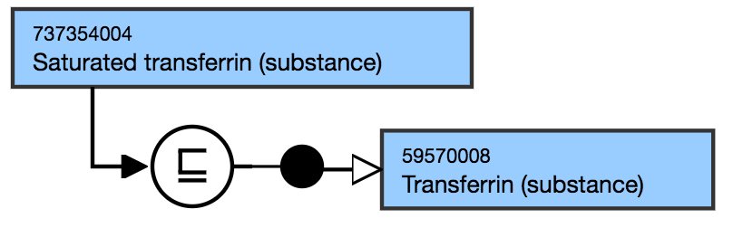

# Saturated or unsaturated substances

## Modeling

Parent concept| Most distal appropriate descendant of 115668003 |Biological substance (substance)|  
---|---  
Semantic tag| (substance)  
Definition status| Primitive  
**Attribute**|  None  
  
## Naming Guidelines

FSN| Saturated X (substance)Unsaturated X (substance)For example,

  *     *       * Unsaturated adipate (substance)

  
---|---  
Preferred Term| Saturated XUnsaturated XFor example,

  *     *       * Unsaturated adipate

  
Synonyms| X Saturated or X UnsaturatedFor example,

  *     *       * Adipate unsaturated

  
  
## Exemplar

The following illustrates the **stated** and **inferred** view:

<figure></figure>
