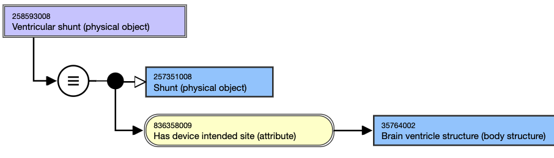
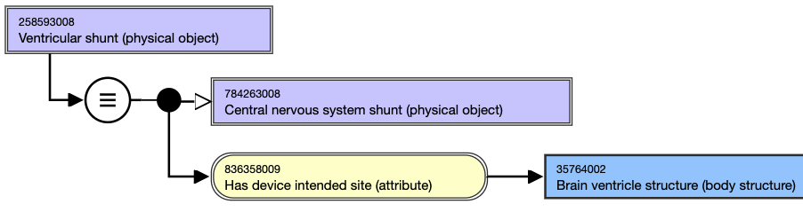

# Shunt Naming and Modeling

## Naming Guidelines

**FSN**|  Use the following naming pattern for the FSN; align terming and case sensitivity with the FSN for the concepts selected as the attribute values, excluding the semantic tag.[compositional material] [body structure] shunt (physical object)For example,

  * Ventricular shunt (physical object)
  * Pleuroperitoneal shunt (physical object)

  
---|---  
**Preferred Term**|  Use the following naming pattern for the PT; align terming and case sensitivity with the PT for the concept that is selected as the attribute value.[compositional material] [body structure] shuntFor example,

  * Ventricular shunt
  * Pleuroperitoneal shunt  

  
Synonym| Synonyms are not generally added for concepts in this hierarchy.  
  
## Modeling (stated view)

Stated parent concept(s)| 257351008 |Shunt (physical object)|  
Additional parent, if applicable:

  * 258166002 |Custom made implant (physical object)

  
---|---  
Semantic tag| (physical object)  
  
**Attribute:** Has device intended site  
| 

  * Note this attribute is used to model the proximal site of the shunt only.
  * Range: <<123037004 |Body structure (body structure)|
    * NOTE: While the MRCM allowed range includes the top-level concept, 123037004 |Body structure (body structure)|, only the descendants should be used in modeling shunt concepts.
  * Cardinality: 0..1

  
**Attribute:** Has compositional material| 

  * Range: <<105590001 |Substance (substance)|
    * NOTE: While the MRCM allowed range includes the top-level concept, 105590001 |Substance (substance)|, only the descendants should be used in modeling shunt concepts.
  * Cardinality: 0..*

  
  
## Exemplars

The following illustrates the **stated** view for 258593008 |Ventricular shunt (physical object)|:

<figure><figcaption>
The following illustrates the <strong>inferred</strong> view for 258593008 |Ventricular shunt (physical object)|:
</figcaption></figure>

<figure></figure>

  

