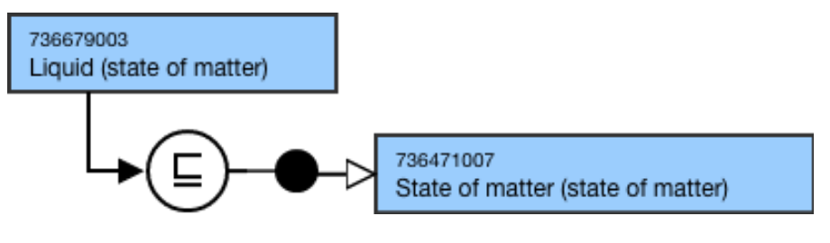

# State of Matter

## Overview

736471007 |State of matter (state of matter)| represents a physical state of matter. 

|State of matter (state of matter)| is a descendant of 362981000 |Qualifier value (qualifier value) that supports fully defining concepts in the 736542009 |Pharmaceutical dose form (dose form)| hierarchy. |State of matter (state of matter)| is used to model concepts in the 736478001 |Basic dose form (basic dose form)| hierarchy; they are not used to model the 736542009 |Pharmaceutical dose form (dose form)| or 763158003 |Medicinal product (product)| hierarchies.

## Modeling

Parent concept| 736471007 |State of matter (state of matter)|  
---|---  
Semantic tag| (state of matter)  
Definition status| Primitive  
Attributes| None  
  
## Naming

**FSN**|  Use the following pattern for the FSN where X is the state of matter:X (state of matter)For example,

  *     *       * Gas (state of matter)
      * Liquid (state of matter)
      * Semi-solid (state of matter)
      * Solid (state of matter)

  
---|---  
**Preferred Term**|  Use the following pattern for the PT where X is the state of matter:XFor example,

  *     *       * Gas
      * Liquid
      * Semi-solid
      * Solid

  
**Synonyms**|  Synonyms are not allowed unless explicitly identified as an exception in the Editorial Guidelines.  
**Text Definitions**|  Preferred; not required.  
  
## Exemplar

The following illustrates the ****stated**** and****inferred**** view for 736679003 |Liquid (state of matter)|:

<figure></figure>
