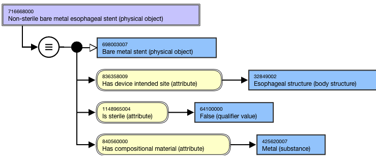
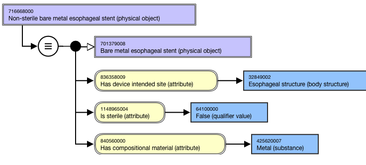

# Stent Naming and Modeling

## Naming Guidelines

FSN| Use the following naming pattern for the FSN; align terming and case sensitivity with the FSN for the concepts selected as the attribute values, excluding the semantic tag.[is sterile] [absorbability] [compositional material] [coating] [device intended site] stent (physical object)For example,

  * Custom-made bioabsorbable vaginal stent (physical object)
  * Bare metal renal artery stent (physical object)
  * Silicon carbide coated intracranial vascular stent (physical object)
  * Sterile polymer coated metal esophageal stent (physical object)

  
---|---  
Preferred Term| Use the following naming pattern for the PT; align terming and case sensitivity with the PT for the concept that is selected as the attribute value. For multiple ingredient drug products, the active ingredients must be in alphabetical order and separated by the word “and”.[is sterile] [absorbability] [compositional material] [coating] [device intended site] stentFor example,

  * Custom-made bioabsorbable vaginal stent
  * Bare metal renal artery stent  

  * Silicon carbide coated intracranial vascular stent
  * Sterile polymer coated metal esophageal stent

  
Synonym| Synonyms are not generally added for concepts in this hierarchy.  
  
## Modeling (stated view)

Stated parent concept| 65818007 |Stent (physical object)|  
258166002 |Custom made implant (physical object)|, if applicableException: 411114003 |Drug coated stent (product)| is modeled with an additional stated parent of 411115002 |Drug-device combination product (product)|   
---|---  
Semantic tag| (physical object)  
  
**Attribute:** Has absorbability| 

  * Range: 860574003 |Bioabsorbable (qualifier value)| OR 863965006 |Nonbioabsorbable (qualifier value)| OR 863968008 |Partially bioabsorbable (qualifier value)|
  * Cardinality: 0..1

  
Attribute: **Has coating material**| 

  * Range: < 105590001 |Substance (substance)|
  * Cardinality: 0..1

  
Attribute: **Has compositional material**| 

  * Range: <<105590001 |Substance (substance)|
    * NOTE: While the MRCM allowed range includes the top-level concept, 105590001 |Substance (substance)|, only the descendants should be used in modeling stent concepts.
  * Cardinality: 0..*

  
 **Attribute:** Has device intended site| 

  * Range: <<123037004 |Body structure (body structure)|
    * NOTE: While the MRCM allowed range includes the top-level concept, 123037004 |Body structure (body structure)|, only the descendants should be used in modeling stent concepts.
  * Cardinality: 0..1

  
**Attribute:** Is sterile| 

  * Range: 31874001 |True (qualifier value)| OR 64100000 |False (qualifier value)
  * Cardinality: 0..1

  
  
## Exemplars

The following illustrates the **stated** view for 716668000 |Non-sterile bare metal esophageal stent (physical object)|:

<figure><figcaption>
The following illustrates the <strong>inferred</strong> view for 716668000 |Non-sterile bare metal esophageal stent (physical object)|:
</figcaption></figure>

<figure></figure>
