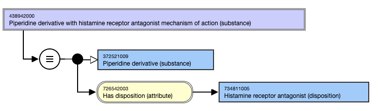
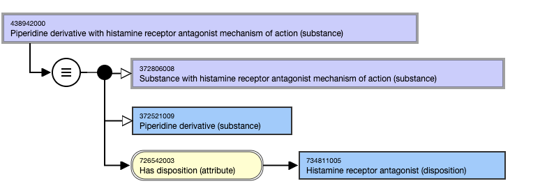

# Substance Groupers Based on Both Structure and Disposition

## Overview

Groupers based on both structure and disposition that are deemed to be clinically useful and that can be sufficiently defined will be included in the |Substance| hierarchy.

_Note: This section applies to concepts representing a single structural parent and a single disposition. It does not apply concepts representing more than one structural parent or disposition._

## Modeling

**Stated parent concept**|  The stated parent concept must be the concept that represents the structural grouper. If such a concept does not exist, it must be created and its stated substance descendants added before the grouper based on both structure and disposition can be created.  
---|---  
**Definition status**|  Defined  
**Attribute:****Has disposition**|  Range: <726711005 |Disposition (disposition)

  *     * While the allowed range is broader, the Substance Groupers based on both Structure and Disposition should only use <726711005 |Disposition (disposition) as the attribute value.

Cardinality: 1..1  
  
## Exemplar for Grouper Concept Based on both Structure and Disposition

The following illustrates the **stated** and **inferred** view for grouper concepts based on both structure and disposition.

  

<figure><figcaption>
Figure 1: Stated view of 438942000 |Piperidine derivative with histamine receptor antagonist mechanism of action (substance)|
</figcaption></figure>

  

  

<figure><figcaption>
Figure 1: Inferred view of 438942000 |Piperidine derivative with histamine receptor antagonist mechanism of action (substance)|
</figcaption></figure>

  

  

## Terming

**FSN**|  Use the following pattern for the FSN, with X representing the structure and Y representing the disposition. The FSN should align with the FSN for the substance grouper and disposition used as the stated parent and attribute value respectively.

  * X with Y mechanism of action (substance)

For example,

  *     *       * Piperazine derivative with histamine H1 receptor antagonist mechanism of action (substance)
      * Substance with dihydropyridine derivative structure and calcium channel blocker mechanism of action (substance)
      * Substance with organophosphorus structure and acetylcholinesterase inhibitor mechanism of action (substance)

  
---|---  
**Preferred Term**|  Use the following pattern for the Preferred Term, with X representing the structure and Y representing the disposition. The FSN should align with the FSN for the substance grouper and disposition used as the stated parent and attribute value respectively.

  * X Y

For example,

  *     *       * Piperazine derivative histamine H1 receptor antagonist
      * Dihydropyridine derivative calcium channel blocker
      * Organophosphorus acetylcholinesterase inhibitor

  
**Synonyms**|  A synonym to match the FSN is not required.Additional synonyms are allowed only if they are consistent with the synonyms for the corresponding structure grouper and disposition.
