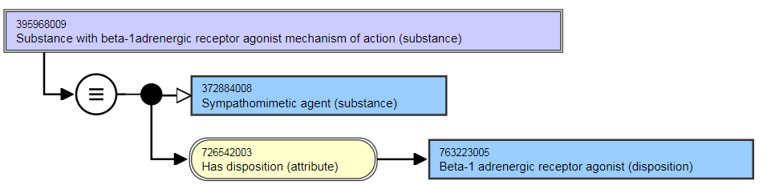
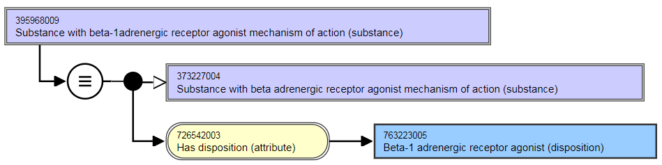

# Substance Groupers Based on Disposition

## Overview

Groupers based on disposition that are deemed to be clinically useful and that can be sufficiently defined will be included in the |Substance| hierarchy. Disposition is defined as a behavior that a substance will exhibit or participate in, given the appropriate context. There is no requirement to introduce a new semantic tag in order to distinguish concepts representing a substance disposition from any other type of concept in the |Substance| hierarchy.

_Note: This section applies to concepts representing a single disposition. It does not apply to concepts representing a disposition combined with a structural grouper or concepts representing more than one disposition._

## Modeling

Parent concept| 105590001 |Substance (substance)|

  * Exceptions: While the goal is to model these concepts using proximal primitive modeling, there will be a transition over several release cycles to get to that state. In the meantime, concepts may have stated parents other than 105590001 |Substance (substance) for the foreseeable future.

  
---|---  
Definition status| Defined  
|Has disposition|| Range: <726711005 |Disposition (disposition)

  *     * While the allowed range is broader, the Substance Groupers based on Disposition should only use <726711005 |Disposition (disposition) as the attribute value.

Cardinality: 1..1

  *     * While the allowed range is broader, the Substance Groupers based on Disposition should have one and only one |Has disposition| attribute.  

  
  
Substance groupers representing etiopathic dispositions (e.g. 88376000 |Carcinogen (substance), 45986006 |Teratogen (substance)) will be created. Since most substances can exhibit these characteristics in some circumstances, the descendant concepts will not be populated. Exceptions will be noted in the editorial guidelines.

## Exemplar for Grouper Concept Based on Disposition

The following illustrates the **stated** view for grouper concepts based on disposition.

<figure><figcaption>
The following illustrates the <strong>inferred</strong> view for grouper concepts based on disposition.
</figcaption></figure>

  

<figure></figure>

## Terming

FSN| Use the following pattern for the FSN. The FSN must reflect the terming used to describe the disposition consistent with the terming of the |Has disposition| attribute value.Example for dispositions that represent a mechanism of action:

  * Substance with opioid receptor agonist mechanism of action (substance)
  * Substance with histamine receptor antagonist mechanism of action (substance)
  * Substance with acetylcholinesterase inhibitor mechanism of action (substance)

  
---|---  
Preferred Term| Use the following pattern for the Preferred Term. The Preferred Term must reflect the terming used to describe the disposition consistent with the terming of the |Has disposition| attribute value.Example for dispositions that represent a mechanism of action:

  * Opioid receptor agonist
  * Histamine receptor antagonist
  * Acetylcholinesterase inhibitor

  
Synonyms| Synonyms corresponding to the FSN are not required.Additional synonyms are allowed only if they are consistent with the synonyms for the corresponding disposition concept.  
  

  

