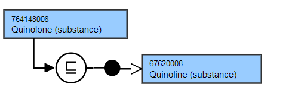
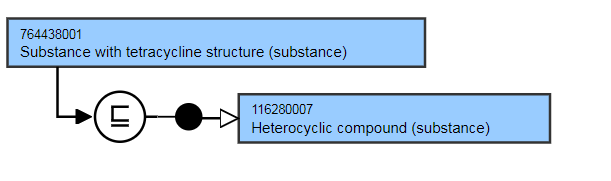
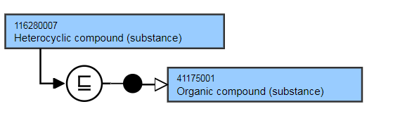
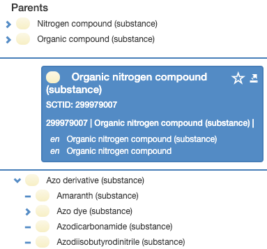
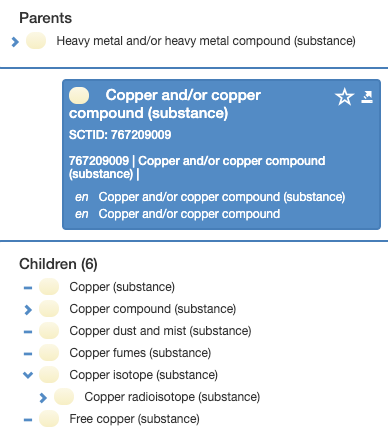
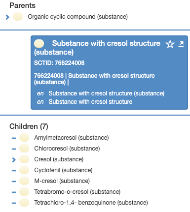

# Substance Groupers Based on Structure

## Overview

Groupers based on structural properties of the substance that are deemed to be clinically useful will be included in the Substance hierarchy.

For example,

  *     * Benzodiazepine (substance)
    * Quinolone (substance)

## Modeling

| Parent concept | Most distal appropriate descendant of 312413002 \| Substance categorized by structure (substance)\| |
|---|---|
| Semantic tag | (substance) |
| Definition status | Primitive |
| Attributes | None |

## Exemplar

The following illustrates the **stated** and **inferred** view.

<figure></figure>

<figure></figure>

<figure></figure>

  

  

## Terming

| FSN | Organic nitrogen compound (substance) Triazine derivative (substance) Copper and/or copper compound (substance) Phenothiazine and/or phenothiazine derivative (substance) Nucleotide (substance) Substance with cresol structure (substance) Substance with benzene structure (substance) Use the following pattern for the FSN. Groupers should be expressed in the singular, i.e.compoundnotcompounds. Example for substances that represent a structural grouper: Halide compound (substance) Where the same word is used to identify both a group of substances with a particular chemical structure and a particular chemical substance the following terming for the FSN will be used for the substance grouper concept.Substance with X structure (substance) For example, Substance with tetracycline structure (substance) |
|---|---|
| Preferred Term | Organic nitrogen compound Triazine derivative Copper and/or copper compound Phenothiazine and/or phenothioazine derivative Nucleotide Substance with cresol structure Substance with benzene structure Use the following pattern for the Preferred Term, For example, Halide compound Where the same word is used to identify both a group of substances with a particular chemical structure and a particular chemical substance the following pattern will be used for PT the substance grouper concept. Substance with X structure For example, Substance with tetracycline structure |
| Synonyms | A synonym to match the FSN must be created. Additional synonyms are not allowed unless explicitly identified as an exception in the editorial guidelines. |

## Exemplar for Hierarchy

<figure><figcaption>
Figure 1: Browser view of 299979007 |Organic nitrogen compound (substance)|
</figcaption></figure>

  

  

<figure><figcaption>
Figure 2: Browser view of 767209009 |Copper and/or copper compound (substance)|
</figcaption></figure>

  

  

  

  

<figure><figcaption>
Figure 3: Browser view of 766224008 |Substance with cresol structure (substance)|
</figcaption></figure>

  

  

  
  

