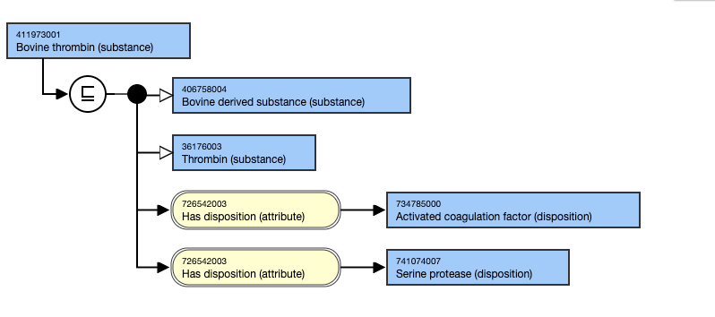

# Substances specifying a source or origin

## Overview

A recombinant (A new entity e.g., gene, protein, cell, or individual that results from genetic recombination) or synthetic/semi-synthetic substance (of, relating to, or produced by chemical or biochemical synthesis; especially: produced artificially) is similar in structure (but not identical to the naturally occurring substance). It should be created as a sibling of the naturally occurring substance.

A substance that is part of (e.g. dander) or is derived from (e.g. Insulin) an organism (human or non-human) is identical and should be created as a child of the naturally occurring substance.

## Modeling

**Parent concept**|  Most distal appropriate descendant of 105590001 |Substance (substance)|  
---|---  
**Semantic tag**| (substance)  
**Definition status**|  Primitive  
**Attribute**|  738774007 |Is modification of (attribute)| as applicable726542003 |Has disposition (attribute)| as appropriate  
  
## Naming

“Recombinant”, “Synthetic”, or “Semi-synthetic” should precede the name of the substance

The source organism name should precede the name of the substance

  * An exception to this rule is the naming of DNA, RNA, rRNA, antibody, Immunoglobulin, and antigen of organisms, which should follow the guideline specified for antibodies and antigens

  * For some non-human sources, there are different ways of referring to the source organism:

    * The common name of the organism e.g. pig, cow, horse, mouse, sheep

      * The common name of an organism is used when referring to a part of the organism or to non-meat products
        * E.g. Pig epithelium, Cow milk
    * An adjective referring to the organism, e.g. porcine, bovine, equine, murine, ovine

      * The adjective is usually used when referring to a substance extracted from the organism
        * E.g. Bovine growth hormone (substance), Porcine calcitonin (substance)
    * The adjective is commonly used in referring to the organism hosting a virus, but there are exceptions. In general, proper name of organism such as virus name should be preserved as it is (including the case sensitivity):
      * Ribonucleic acid of Bovine leukemia virus (substance)
      * Immunoglobulin G antibody to Eastern equine encephalitis virus (substance)
      * Antigen of Nairobi sheep disease virus (substance)

Additional adjectives (such as labeled, Iodinated) should proceed the name of source organism

For example,

    * Lente human insulin (substance)

    * Iodinated (125-I) human serum albumin (substance)

If a concept includes “recombinant” or “synthetic” as well as a source organism, “recombinant” or “synthetic” should precede the source organism name

For example,

    * Recombinant bovine growth hormone (substance)

**FSN**|  Pattern:

  * [Source organism] X (substance)
  * Recombinant X (substance)
  * Synthetic X (substance)

For example,

  *     *       * Human antithrombin III (substance)
      * Recombinant thrombin (substance)
      * Synthetic steroid (substance) 

  
---|---  
**Preferred Term**|  Pattern:

  * [Source organism] X
  * Recombinant X
  * Synthetic X

For example,

  *     *       * Human antithrombin III
      * Recombinant thrombin
      * Synthetic steroid

  
**Exception**|  The naming of DNA, RNA, rRNA, antibody, Immunoglobulin, and antigen of organisms should follow the specific guideline for this type of substances.  
  
Exemplar

## Exemplar

Stated view of 411973001 |Bovine thrombin (substance)|

<figure></figure>

  

  

  

  

