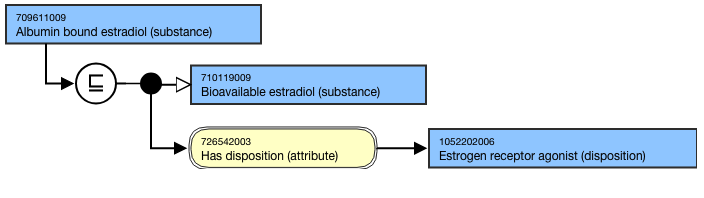

# Substances specifying bound

## Bound substances Overview

Creation of substance concepts that contain “bound” is limited to the measurement of biological substances (Observable entities, evaluation procedures, LOINC collaboration project) or to report their level (clinical findings).

Where the substance is "bound" the molecule to which the substance is bound to may be specified in the term.

## Modeling

Parent concept| Most distal appropriate descendant of 115668003 |Biological substance (substance)|  
---|---  
Semantic tag| (substance)  
Definition status| Primitive  
Attribute| 726542003 |Has disposition (attribute)|  
  
## Terming Guidelines

FSN| Pattern: Bound X (substance)For example,

  *     *       * Bound insulin (substance)
      * Protein bound iodine (substance)  

      * Albumin bound thyroxine (substance)  

  
---|---  
Preferred Term| Pattern: Bound X (substance)For example,

  *     *       * Bound insulin
      * Protein bound iodine (substance)  

      * Albumin bound thyroxine (substance)  

  
  
## Exemplar

The following illustrates the **stated** and**inferred** view:

<figure></figure>

  

