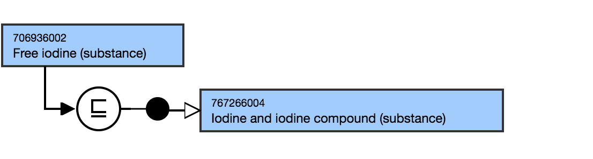
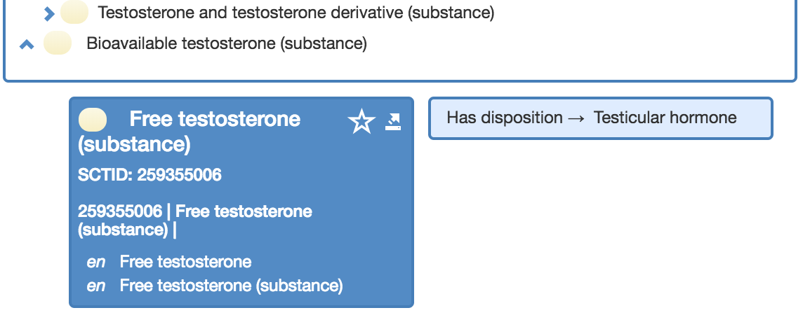

# Substances specifying free or unbound or unconjugated

## Overview

Creation of substance concepts that contain terms such as “free” (or "unbound" or "unconjugated") is limited to the measurement of biological substances (Observable entities, evaluation procedures, LOINC collaboration project) or to report their level (clinical findings). These concepts are created as siblings of the base concepts with a "substance X and X derivatives" or "X and X compound" as common supertype.

## Modeling

Parent concept| Most distal appropriate descendant of 105590001 |Substance (substance)|  
---|---  
Semantic tag| (substance)  
Definition status| Primitive  
Attribute| 726542003 |Has disposition (attribute)|  
  
## Naming

FSN| Pattern: Free X (substance)For example,

  *     *       * Free iodine (substance)  

  
---|---  
Preferred Term| Pattern: Free XFor example,

  *     *       * Free iodine

  
Synonyms| Optional pattern: Unbound xFor example,

  *     *       * Unbound iodine

  
  
## Exemplar

The following illustrates both the **stated** and **inferred** view:

<figure><figcaption>
The following illustrates the hierarchy view:
</figcaption></figure>

  

  

<figure></figure>
