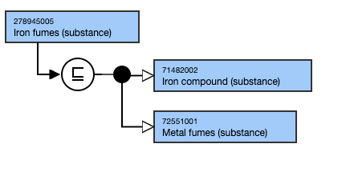
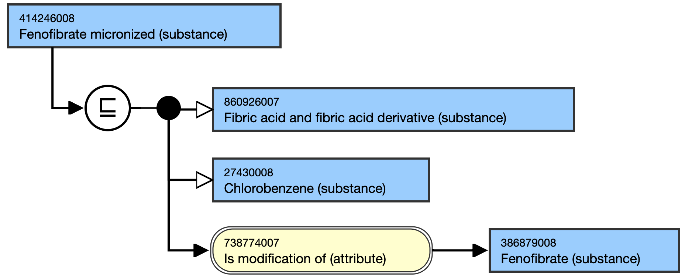

# Substances specifying physical state or physical form

## Overview

Concepts specifying a particular physical state (e.g. liquid, solid, fumes, vapor, crystal, foam) of a substance should be represented as the sibling for the unspecified substance and also have a parent concept that relates to the structure of the substance.

Concepts specifying a particular physical form (e.g. micronized, macrocrystal, microsphere) should have a parent concept that relates to the structure of the substance and also an Is modification of (attribute) relationship to the unspecified substance concept.

## Modeling - Micronized substance

| Parent concept | Most distal appropriate descendant of105590001\|Substance (substance)\| An additional parent concept to be allocated to denote physical form as appropriate |
|---|---|
| Semantic tag | (substance) |
| Definition status | Primitive |
| Attributes | 738774007 \|Is modification of (attribute)\| relationship to the unspecified substance 726542003 \|Has disposition (attribute)\| as appropriate |

## Naming

Fumes should be expressed in the plural (i.e. fumes as opposed to fume).

Fumes and vapor are different and so should not be used as synonyms on the same concept. <https://www.commerce.wa.gov.au/worksafe/gases-vapours-smoke-and-fumes>

| FSN | X fumes (substance) X micronized (substance) Pattern: For example, Bauxite fumes (substance) Fenofibrate micronized (substance) |
|---|---|
| Preferred Term | X fumes X micronized Bauxite fumes Fenofibrate micronized Pattern: For example, |
| Synonyms | Fenofibrate micronised Pattern:X form to represent EN-GB language variants where appropriate For example, |

### Exemplar

<figure><figcaption>
Figure: View of both stated and inferred form of 278945005 |Iron fumes (substance)|
</figcaption></figure>

  

<figure><figcaption>
Figure: Stated view of 414246008 |Fenofibrate micronized (substance)|
</figcaption></figure>

  

  

