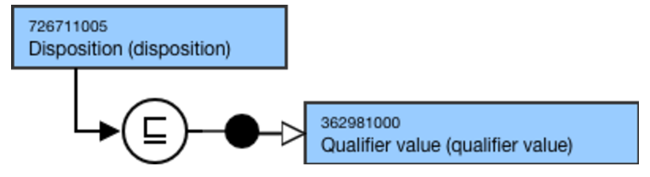
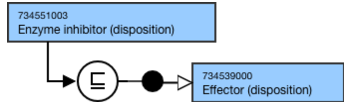
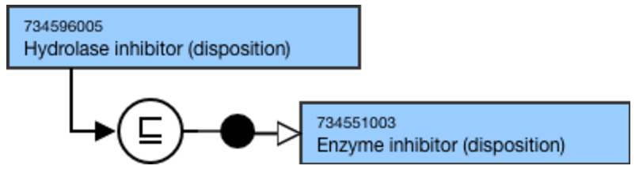

# Supporting hierarchy - Disposition

## Overview

The hierarchy, 726711005 |Disposition (disposition)|, was created to support the remodeling of the Substance hierarchy. The concepts in this hierarchy are used as the attribute value for the |Has disposition (attribute)| for concepts in the Substance hierarchy, to sufficiently define grouper concepts representing dispositions, and to sufficiently define concepts in other SNOMED CT hierarchies. To provide adequate context to differentiate concepts in this hierarchy from similar concepts in other existing SNOMED CT hierarchies, a new (disposition) semantic tag was created.

### Modeling

Parent concept| <<726711005 |Disposition (disposition)|  
---|---  
Semantic tag| (disposition)  
Definition status| Primitive  
Attributes| Not applicable  
  
### Terming Guidelines

General Terming Guidelines  
The following words should be avoided unless specifically identified as an exception in the editorial guidelines.

  *     * agent
    * analog
    * and
    * and/or
    * content(s)
    * derivative
    * material
    * metabolite
    * modification
    * or
    * preparation
    * product
    * substance

Exceptions:

  *     * Alkylating agent (disposition)
    * Chelating agent (disposition)

  
Descriptions should be singular, not plural.  
  
  

**Disposition representing:**

  * receptor agonist or partial agonist
  * receptor antagonist or partial antagonist
  * enzyme inhibitor or  
enzyme system inhibitor
  * enzyme activator

| FSN| Patterns:

  * **_X_** receptor agonist (disposition)
  * **_X_** receptor antagonist (disposition)
  * **_X_** inhibitor (disposition)  

  * **_X_** activator (disposition)

Example of receptor agonist:

  * Dopamine receptor agonist (disposition)
  * Opioid receptor agonist (disposition)
  * Opioid receptor partial agonist (disposition)  

Example of receptor antagonist:

  * Beta-adrenergic receptor antagonist (disposition)
  * Histamine receptor antagonist (disposition)
  * Opioid receptor antagonist (disposition)
  * Opioid receptor partial antagonist (disposition)

Example of inhibitor (enzyme):

  * Acetylcholinesterase inhibitor (disposition)
  * Phosphodiesterase 5 inhibitor (disposition)

Example of inhibitor (enzyme system):

  * Hydrogen/potassium adenosine triphosphatase enzyme system inhibitor (disposition)
  * Selective serotonin reuptake inhibitor (disposition)

Example of activator:

  * Plasminogen activator (disposition)

  
---|---|---  
Preferred Term| Patterns:

  * **_X_** receptor agonist
  * ** _X_** receptor antagonist
  * ** _X_** inhibitor
  * ** _X_** activator

Example of receptor agonist:

  * Dopamine receptor agonist
  * Opioid receptor agonist

Example of receptor antagonist:

  * Beta-adrenergic receptor antagonist
  * Histamine receptor antagonist
  * Opioid receptor antagonist

Example of enzyme inhibitor:

  * Acetylcholinesterase inhibitor
  * Phosphodiesterase 5 inhibitor
  * Centrally acting acetylcholinesterase inhibitor

Example of enzyme system inhibitor:

  * Proton pump inhibitor
  * Selective serotonin reuptake inhibitor

Example of enzyme inducer:

  * Plasminogen activator

Exceptions:

  * Preferred terms may reflect the common clinical description for a disposition.  

    * Example:
      * |Hydrogen/potassium adenosine triphosphatase enzyme system inhibitor (disposition)| has Preferred Term |Proton pump inhibitor|
      * |3-Hydroxy-3-methylglutaryl-coenzyme A reductase inhibitor (disposition)| has Preferred Term |HMG-CoA reductase inhibitor|

  
Synonyms| Synonyms are not allowed unless explicitly identified as an exception.  
**Disposition representing:**

  * response induced in an organism by a substance

| FSN| Pattern:

  * _**X**_ (disposition)

Example:

  * Growth factor (disposition)
  * Cytokine (disposition)
  * Carcinogen (disposition)
  * Potassium channel blocker (disposition)
  * Calcium channel blocker (disposition)
  * Fusion inhibitor (disposition)

  
Preferred Term| Pattern:  

  * _**X**_

Example:

  * Growth factor
  * Cytokine
  * Carcinogen
  * Potassium channel blocker
  * Calcium channel blocker
  * Fusion inhibitor

  
Synonyms| Synonyms are not allowed unless explicitly identified as an exception.  
__ Disposition representing:

  * a chemical effect or physical property

|  __ FSN| Pattern:

  * _**X**_ (disposition)

Example:

  * Alkylating agent (disposition)
  * Chelating agent (disposition)

  
Preferred Term|  __ Pattern:

  * _**X**_

Example:

  * Alkylating agent
  * Chelating agent

  
Synonyms| Synonyms are not allowed unless explicitly identified as an exception.  
  
## Exemplar

The following illustrates the **stated** and **inferred** view:

<figure></figure>

  

<figure></figure>

  

<figure></figure>
