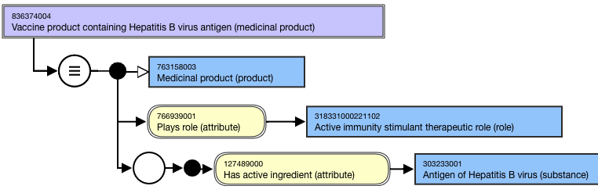
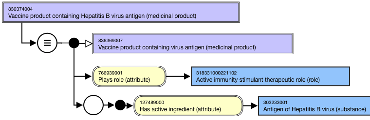

# Vaccine Product containing Concepts

## Overview

The Vaccine Product "containing" concept is an abstract representation of the active ingredient(s) in a vaccine product. It means that the vaccine product must contain the active ingredient(s) specified in the FSN but may also contain a modification of the active ingredient(s) specified in the FSN or may contain additional active ingredient(s).

For example,

  *     * 836374004 |Vaccine product containing Hepatitis B virus antigen (medicinal product)|
    * 836389008 |Vaccine product containing Vaccinia virus antigen (medicinal product)|

Both vaccine product "containing" and vaccine product "containing only" concepts may be created for products that only have one active ingredient (e.g. 836374004 |Vaccine product containing Hepatitis B virus antigen (medicinal product)| and 871822003 |Vaccine product containing only Hepatitis B virus antigen (medicinal product)|).

Vaccine product "containing" concepts are not created for multiple ingredient vaccine products; vaccine product "containing only" concepts are created for multiple ingredient vaccine products.

## Modeling

Stated parent concept| 763158003 |Medicinal product (product)  
---|---  
Semantic tag| (medicinal product)  
Definition status| Defined  
Attribute:Has active ingredient| Range: <105590001 |Substance (substance) excluding concepts representing structural groupers, dispositions, or combined substancesCardinality: 1..*

  *     * While the allowed range is broader, Vaccine product "containing" concepts in the International Release should have one and only one |Has active ingredient| attribute.

For content in the International Release, this attribute value should represent the organism antigen, not a modification or subtype, unless explicitly identified as an exception.Exceptions: Vaccine product containing concepts for the following substance subtypes are included (to support vaccination certificates):

  *     * 161000221102 |Antigen of Corynebacterium diphtheriae toxoid (substance)|
    * 551000221106 |Antigen of Clostridium tetani toxoid (substance)|

  
Attribute:Plays role| Range: <<766940004 |Role (role)|  
Cardinality: 0..*

  *     * While the allowed range is broader, Vaccine product "containing" concepts should have one and only one |Plays role| attribute with attribute value = 318331000221102 |Active immunity stimulant therapeutic role (role)|.

  
  
## Naming

**FSN**|  Use the following pattern for the FSN; align naming and case sensitivity with the PT for the concept that is selected as the attribute value for the 127489000 |Has active ingredient (attribute)|. For multiple ingredient vaccine products, the active ingredients must be listed in alphabetical order, separated by the word "and", and the word "antigen" will be omitted. For concepts where all active ingredients are virus, the word "virus" may be omitted and added before "antigens".

  * Vaccine product containing <Active ingredient PT> (medicinal product)

For example,

  *     *       * Vaccine product containing Hepatitis B virus antigen (medicinal product)  

      * Vaccine product containing Haemophilus influenzae type B antigen (medicinal product)

  
---|---  
**Preferred Term**|  Use the following pattern for the PT; align naming and case significance with the PT for the concept that is selected as the attribute value for the 127489000 |Has active ingredient (attribute)|.  For multiple ingredient vaccine products, the active ingredients must be listed in alphabetical order, separated by the word "and", and the word "antigen" will be omitted. For concepts where all active ingredients are virus, the word "virus" may be omitted and added before "antigens".

  * <Active ingredient PT>-containing vaccine product _  
_

For example,

  *     *       * Hepatitis B virus antigen-containing vaccine product
      * Haemophilus influenzae type B antigen-containing product

  
**Synonyms**|  Synonyms matching the FSN are not required.Synonyms corresponding to the disorder that is the target of the vaccine are not allowed; they may be applied to the "Vaccine product containing only" concepts.  
  
## Exemplars

The following illustrates the **stated** view for 836374004 |Vaccine product containing Hepatitis B virus antigen (medicinal product)|:

<figure><figcaption>
The following illustrates the <strong>inferred</strong> view for 836374004 |Vaccine product containing Hepatitis B virus antigen (medicinal product)|:
</figcaption></figure>

<figure></figure>

  

