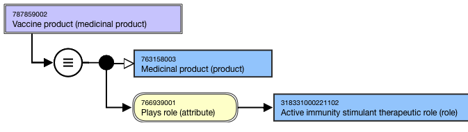
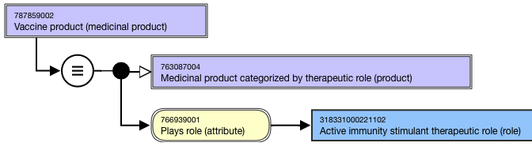
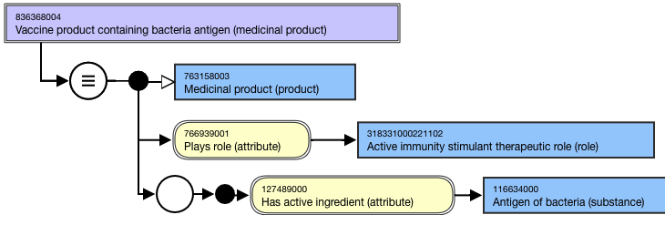
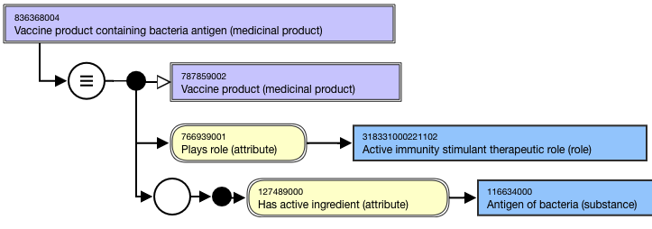
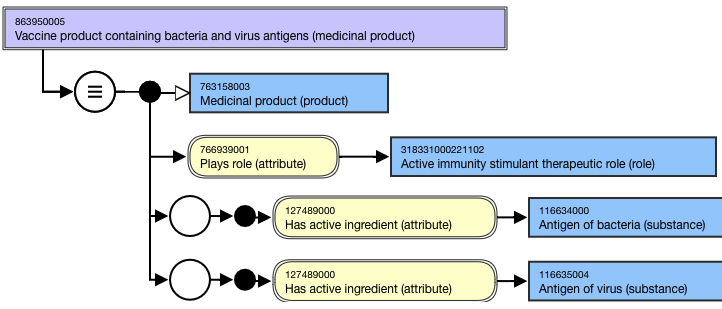
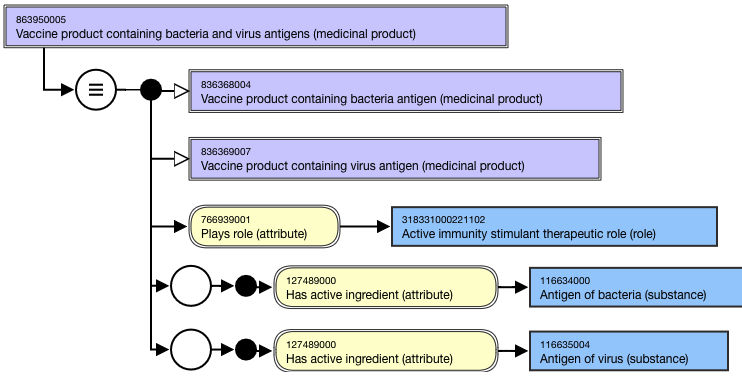

# Vaccine Product Top Level Groupers

## Overview

The following high level vaccine-related grouper concepts are included in the |Medicinal product| hierarchy.

  * 787859002 |Vaccine product (medicinal product)|
    * 836368004 |Vaccine product containing bacteria antigen (medicinal product)|
    * 1290123005 |Vaccine product containing protozoa antigen (medicinal product)|
    * 836369007 |Vaccine product containing virus antigen (medicinal product)|  

## Modeling

**Stated parent concept**|  763158003 |Medicinal product (product)  
---|---  
**Semantic tag**| (medicinal product)  
**Definition status**|  Defined  
Attribute:Has active ingredient| Range: <<105590001 |Substance (substance)|  
Cardinality: 0..*_Exception:__Top level grouper 787859002 |Vaccine product (medicinal product)| does not have a Has active ingredient (attribute)._  
Attribute:Plays role| Range: <<766940004 |Role (role)|  
Cardinality: 0..*

  *     * While the allowed range is broader, top level vaccine-related grouper concepts should have one and only one Plays role (attribute) with attribute value = 318331000221102 |Active immunity stimulant therapeutic role (role)|.

  
  
## Naming

**FSN**|  Use the following pattern for the FSN;__ align naming and case sensitivity with the PT for the concept that is selected as the attribute value for the 127489000 |Has active ingredient (attribute)|.Vaccine product containing <Active ingredient PT excluding "antigen"> antigen (medicinal product)Vaccine product containing <Active ingredient PT excluding "antigen"> and <Active ingredient PT excluding "antigen"> antigens (medicinal product)For example,

  *     *       *         *           * Vaccine product (medicinal product)_  
_
          * Vaccine product containing bacteria antigen (medicinal product)
          * Vaccine product containing virus antigen (medicinal product)
          * Vaccine product containing bacteria and virus antigens (medicinal product)

  
---|---  
**Preferred Term**|  Use the following pattern for the PT; align naming and case significance with the PT for the concept that is selected as the attribute value for the 127489000 |Has active ingredient (attribute)|.<Active ingredient PT excluding "antigen">-containing vaccine product<Active ingredient PT excluding "antigen">\- and <Active ingredient PT excluding "antigen"> antigens-containing vaccine productFor example,

  *     *       *         *           * Vaccine product
          * Bacteria antigen-containing vaccine product
          * Virus antigen-containing vaccine product _  
_
          * Bacteria- and virus antigens-containing vaccine product

  
**Synonyms**|  Synonyms matching the FSN are not required.  
  
## Exemplars

The following illustrates the **stated** view for 787859002 |Vaccine product (product)|:

<figure><figcaption>
The following illustrates the <strong>inferred</strong> view for 787859002 |Vaccine product (product)|:
</figcaption></figure>

<figure><figcaption>
The following illustrates the <strong>stated</strong> view for 836368004 |Vaccine product containing bacteria antigen (medicinal product)|:
</figcaption></figure>

<figure><figcaption>
The following illustrates the <strong>inferred</strong> view for 836368004 |Vaccine product containing bacteria antigen (medicinal product)|:
</figcaption></figure>

<figure><figcaption>
The following illustrates the <strong>stated</strong> view for 863950005 |Vaccine product containing bacteria and virus antigens (medicinal product)|:
</figcaption></figure>

<figure><figcaption>
The following illustrates the <strong>inferred</strong> view for 863950005 |Vaccine product containing bacteria and virus antigens (medicinal product)|:
</figcaption></figure>

  

<figure></figure>

  

